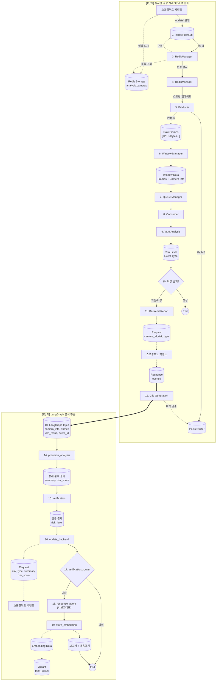
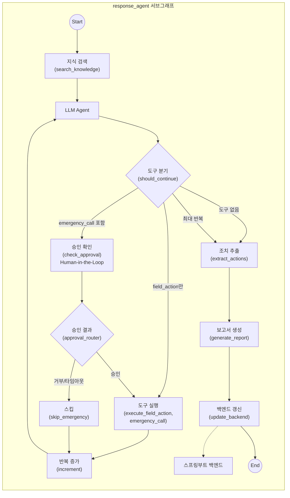

# AEGIS AI Agent

> LangGraph 기반 실시간 영상 분석 파이프라인

## 개요

AEGIS AI Agent는 RTSP 스트림을 실시간으로 수신하여 VLM(Vision Language Model) 분석을 수행하고, 이상 감지 시 LangGraph 기반 다단계 추론 파이프라인을 통해 정밀 분석, 백엔드 보고, 영상 클립 생성을 자동화하는 시스템입니다.

## 기술 스택

| 분류 | 기술 | 버전 | 용도 |
|------|------|------|------|
| Language | Python | 3.12.12 | 메인 언어 |
| Container | Docker | python:3.12-slim (3.12.12) | 컨테이너 베이스 이미지 |
| Framework | LangGraph | 1.0.7 | 상태 기반 워크플로우 |
| Framework | LangChain Core | 1.2.7 | LLM 추상화 |
| API | FastAPI | 0.128.0 | REST API 서버 |
| API | Uvicorn | 0.40.0 | ASGI 서버 |
| 영상처리 | PyAV | 16.1.0 | RTSP 패킷 수신 및 Muxing |
| 영상처리 | OpenCV | 4.13.0 | 프레임 리사이징/인코딩 |
| 캐시 | Redis | 7.1.0 | 카메라 목록 동기화, Pub/Sub |
| HTTP | Requests | 2.32.5 | 백엔드/VLM/LLM 통신 |
| 유효성검사 | Pydantic | 2.12.5 | 데이터 모델 검증 |

## 프로젝트 구조

```
src/
├── __init__.py
├── app.py                      # 메인 진입점 (FastAPI 앱 + AegisAgent 오케스트레이터)
├── config.py                   # Config 데이터클래스 (전체 설정 관리)
├── utils.py                    # 유틸리티 (로깅, 시그널 핸들러, 지수 백오프)
│
├── api/
│   ├── __init__.py
│   └── mock_server.py          # Mock 서버 (VLM, Backend)
│
├── clients/
│   ├── __init__.py
│   ├── backend_client.py       # 백엔드 API 클라이언트 (이벤트 CRUD, 클립/보고서 업로드)
│   ├── precision_client.py     # 정밀 분석 LLM 클라이언트
│   ├── vlm_client.py           # VLM 분석 클라이언트
│   ├── vector_store_client.py  # Qdrant Vector DB 클라이언트
│   ├── verification_client.py  # 검증 클라이언트 (OpenAI Vision API 기반)
│   └── openai_client.py        # OpenAI API 클라이언트 (Vision, Embedding, Chat)
│
├── core/
│   ├── __init__.py
│   ├── producer.py             # RTSP 패킷 수신 스레드 (PyAV 기반)
│   ├── packet_buffer.py        # 30초 원형 패킷 버퍼 (키프레임 백트래킹)
│   ├── muxer.py                # MP4 Muxing (faststart, edts 제거, 해상도 패치)
│   ├── consumer.py             # 분석 워커 풀 (VLM → 클립 생성 → LangGraph)
│   ├── queue_manager.py        # 오버플로우 보호 작업 큐
│   ├── windowing.py            # 프레임 슬라이딩 윈도우 생성기
│   └── redis_manager.py        # Redis Pub/Sub 기반 카메라 동기화
│
├── graph/
│   ├── __init__.py
│   ├── analysis_graph.py       # LangGraph 워크플로우 빌더
│   ├── state.py                # AnalysisState TypedDict 정의
│   ├── nodes/
│   │   ├── __init__.py
│   │   ├── verification.py     # 정밀 분석 결과 검증 (VerificationClient 사용)
│   │   ├── precision_analysis.py # 정밀 분석 LLM 호출
│   │   ├── update_backend.py   # 백엔드 이벤트 갱신
│   │   └── store_embedding.py  # 이벤트 임베딩 저장 (response_agent 완료 후 순차 실행)
│   ├── subgraphs/
│   │   ├── __init__.py
│   │   ├── response_agent.py   # ReAct Agent 서브그래프 빌더
│   │   ├── state.py            # ResponseAgentState 정의
│   │   ├── nodes/              # 서브그래프 노드 (기능별 분리)
│   │   │   ├── __init__.py
│   │   │   ├── search_knowledge.py   # 지식 검색 (매뉴얼 + 과거 사례)
│   │   │   ├── agent.py              # LLM 에이전트 + 시스템 프롬프트
│   │   │   ├── check_approval.py     # HITL 승인 관련
│   │   │   ├── extract_actions.py    # 조치 정보 추출
│   │   │   ├── generate_report.py    # 보고서 생성
│   │   │   └── update_backend.py     # 백엔드 갱신
│   │   └── edges/              # 서브그래프 라우터 (조건부 분기)
│   │       ├── __init__.py
│   │       └── routers.py            # should_continue, approval_router
│   └── edges/
│       ├── __init__.py
│       └── routers.py          # 조건부 분기 (analysis_router, verification_router)
│
└── tools/                      # LangChain 도구 및 유틸리티
    ├── __init__.py
    ├── manual_templates.py     # 대응 매뉴얼 템플릿 (이벤트 유형별)
    ├── search_tools.py         # 매뉴얼/사례 검색 (VectorStoreClient 사용)
    └── response_tools.py       # 대응 도구 (execute_field_action, emergency_call)

templates/
└── reports/                    # 보고서 템플릿
    ├── README.md               # 템플릿 사용법
    └── report_template.html    # HTML 보고서 템플릿
```

---

## 핵심 컴포넌트 상세

### app.py - AegisAgent

메인 오케스트레이터 클래스입니다. FastAPI 앱의 lifespan 컨텍스트에서 초기화됩니다.

**주요 속성:**
- `queue_manager`: 분석 작업 큐
- `window_manager`: 프레임 윈도우 관리
- `consumer_pool`: 분석 워커 풀
- `redis_manager`: 카메라 동기화
- `producers`: 카메라별 프로듀서 딕셔너리
- `packet_buffers`: 카메라별 패킷 버퍼
- `source_streams`: 카메라별 스트림 메타데이터

**FastAPI 엔드포인트:**

| Method | Path | 설명 |
|--------|------|------|
| GET | `/health` | 헬스 체크 |
| GET | `/status` | 에이전트 상태 조회 |

> **Note**: Human-in-the-Loop 승인은 백엔드 API를 경유하여 처리됩니다. (아래 HITL 섹션 참조)

---

### config.py - Config

모든 설정을 관리하는 데이터클래스입니다.

**모드 설정:**

| 설정 | 기본값 | 설명 |
|------|--------|------|
| `real_vlm` | `False` | 실제 VLM 서버 사용 |
| `real_backend` | `False` | 실제 백엔드 서버 사용 |

> `config.py`에서 `True`로 설정하면 CLI 플래그 없이도 항상 실제 서버를 사용합니다.
> CLI 플래그(`--real-vlm` 등)는 `False` → `True` 전환만 가능하며, `True` → `False` 전환은 불가합니다.

**RTSP/프레임 설정:**

| 설정 | 기본값 | 설명 |
|------|--------|------|
| `rtsp_host` | `127.0.0.1` | RTSP 서버 호스트 |
| `rtsp_port` | `8554` | RTSP 서버 포트 |
| `frame_width` | `640` | 분석용 이미지 너비 |
| `frame_height` | `360` | 분석용 이미지 높이 |
| `jpeg_quality` | `60` | JPEG 품질 |
| `fps` | `1` | 분석 FPS |
| `video_buffer_seconds` | `30` | 패킷 버퍼 시간 |

**분석 파이프라인 설정:**

| 설정 | 기본값 | 설명 |
|------|--------|------|
| `num_workers` | `4` | 워커 스레드 수 |
| `window_size` | `8` | 윈도우 프레임 수 |
| `window_slide` | `4` | 윈도우 슬라이드 간격 |
| `flush_timeout` | `30` | 타임아웃 강제 처리 |
| `min_flush_size` | `5` | 강제 처리 최소 프레임 |
| `queue_max_size` | `20` | 큐 최대 크기 |

**네트워크 설정:**

| 설정 | 기본값 | 설명 |
|------|--------|------|
| `vlm_timeout` | `30` | VLM 타임아웃 |
| `precision_timeout` | `60` | 정밀 분석 타임아웃 |
| `backend_timeout` | `10` | 백엔드 타임아웃 |
| `redis_host` | `localhost` | Redis 호스트 |
| `redis_port` | `6379` | Redis 포트 |

---

### core/producer.py - FrameProducer

RTSP 스트림을 수신하는 스레드입니다.

**처리 경로:**
- **Path A (분석)**: 패킷 디코딩 → BGR 이미지 → 리사이즈 → JPEG → WindowManager
- **Path B (저장)**: 원본 패킷을 PacketBuffer에 저장 (디코딩 없음)

**주요 메서드:**
- `_open_stream()`: PyAV로 RTSP 스트림 열기 (TCP 강제, 5초 타임아웃)
- `_preprocess_frame()`: 리사이즈 + JPEG 인코딩
- `run()`: 메인 루프 - 패킷 수신 → 버퍼 저장 → 디코딩 → 분석

---

### core/packet_buffer.py - PacketBuffer

최근 30초 패킷을 저장하는 원형 버퍼입니다.

**주요 메서드:**
- `add_packet()`: 패킷 추가, 오래된 패킷 자동 제거
- `get_full_buffer()`: 키프레임 백트래킹 후 패킷 리스트 반환

**키프레임 백트래킹:**
1. 시작 시점 계산 (현재 - clip_duration)
2. 시작점 이전의 가장 가까운 키프레임 탐색
3. 키프레임부터 끝까지 패킷 리스트 반환

---

### core/muxer.py - MP4 Muxing

패킷을 브라우저 재생 가능한 MP4로 변환합니다.

**mux_packets_to_mp4() 처리 과정:**
1. PyAV로 MP4 컨테이너 생성
2. DTS/PTS 정규화 (0부터 시작, 단조 증가)
3. ftyp 앞 쓰레기 제거
4. faststart 적용 (moov를 mdat 앞으로)
5. edts 박스 제거 (재생 위치 문제 방지)
6. avc1/tkhd 해상도 패치 (PyAV 버그 대응)

**내부 함수:**
- `_find_atom()`: MP4 atom 위치 탐색
- `_patch_stco()`: moov 이동 후 stco/co64 오프셋 재계산
- `_remove_edts()`: edts 박스 제거
- `_patch_resolution()`: avc1/tkhd에 해상도 강제 설정
- `_faststart()`: moov를 mdat 앞으로 이동

---

### core/consumer.py - ConsumerPool

분석 작업을 처리하는 워커 풀입니다.

**워커 처리 흐름:**
1. 큐에서 작업 인출
2. VLM 1차 분석 수행
3. NORMAL이면 종료
4. ABNORMAL/SUSPICIOUS면:
   - 백엔드에 이벤트 생성 (event_id 획득)
   - PacketBuffer에서 패킷 추출
   - mux_packets_to_mp4()로 클립 생성
   - presigned URL로 S3 업로드
   - 클립 업로드 확인
   - LangGraph 파이프라인 실행

**통계:**
- `total_processed`: 처리 완료
- `total_failed`: 실패
- `total_abnormal`: 이상 감지
- `total_normal`: 정상
- `total_vlm_time`: VLM 분석 시간 합계

---

### core/windowing.py - WindowManager

프레임을 슬라이딩 윈도우로 그룹화합니다.

**주요 로직:**
- `add_frame()`: 프레임 추가
- `_window_loop()`: 백그라운드 스레드
  - window_slide 간격마다 윈도우 생성
  - flush_timeout 경과 시 강제 처리

---

### core/queue_manager.py - QueueManager

오버플로우 보호가 있는 작업 큐입니다.

- `put()`: 큐가 가득 차면 가장 오래된 작업 삭제 후 추가
- `get()`: 타임아웃 대기 후 작업 반환

---

### core/redis_manager.py - RedisManager

Redis 기반 카메라 동기화를 담당합니다.

- `get_analysis_cameras()`: analysis:cameras 키에서 카메라 목록 조회
- `_pubsub_loop()`: camera:analysis:update 채널 구독

---

### clients/backend_client.py - BackendClient

백엔드 API 통신을 담당합니다.

| 메서드 | 엔드포인트 | 설명 |
|--------|-----------|------|
| `send_vlm_result()` | POST /internal/agent/events | 이벤트 생성, event_id 반환 |
| `update_event()` | PATCH /internal/agent/events/{id}/analysis | 정밀 분석 결과로 갱신 |
| `get_clip_upload_url()` | GET /internal/agent/events/{id}/clip/upload-url | presigned URL 획득 |
| `upload_clip()` | PUT {presigned_url} | MP4 직접 업로드 |
| `confirm_event_clip()` | POST /internal/agent/events/{id}/clip/confirm | 업로드 완료 확인 |

---

### clients/vlm_client.py - VLMClient

VLM 서버와 통신합니다.

**analyze_frames() 요청:**
- camera_id, frames (base64), timestamp, window_start/end

**응답:**
- risk_level: NORMAL / SUSPICIOUS / ABNORMAL
- event_type: ASSAULT / BURGLARY / DUMP / SWOON / VANDALISM

---

### clients/precision_client.py - PrecisionClient

정밀 분석 LLM 서버와 통신합니다.

**send_for_analysis() 요청:**
- camera_id, frames, vlm_result, occurred_at

**응답:**
- risk, event_type, summary, risk_score

---

### clients/verification_client.py - VerificationClient

정밀 분석 결과를 OpenAI Vision API로 검증합니다.

**verify() 메서드:**
- 입력: camera_id, frames (8개 JPEG), summary, event_type, camera_name, camera_location
- 출력: `{"risk_level": str, "event_type": str, "reason": str}`

**검증 프로세스:**
1. 8개 이미지와 정밀 분석 결과를 OpenAI Vision API에 전송
2. 이미지에서 실제로 이상 상황이 보이는지 확인
3. ABNORMAL 유지 또는 SUSPICIOUS로 변경 판정

**설정:**
- `config.openai_chat_model`: 사용 모델 (기본: gpt-4.1-mini)
- `config.verification_system_prompt`: 검증 시스템 프롬프트
- `config.verification_max_retries`: 최대 재시도 횟수
- `config.verification_retry_delay`: 재시도 간격

---

### graph/state.py - AnalysisState

LangGraph 파이프라인의 상태 정의입니다.

**초기 입력 (Consumer에서 주입):**

| 필드 | 타입 | 태그 | 설명 |
|------|------|------|------|
| camera_id | str | [M/S] | 카메라 ID |
| camera_name | str | [M/S] | 카메라 이름 |
| camera_location | str | [M/S] | 카메라 위치 |
| occurred_at | datetime | [M/S] | 분석 윈도우 시작 시점 |
| frames | List[bytes] | [M] | JPEG 이미지 바이트 리스트 |
| frame_timestamps | List[datetime] | [M] | 각 프레임의 타임스탬프 |
| event_id | str | [M/S] | 백엔드에서 생성된 이벤트 ID |
| vlm_result | Dict | [M] | 1차 VLM 분석 원본 결과 |
| window_start | int/str | [M] | 윈도우 시작 시간 |
| window_end | int/str | [M] | 윈도우 종료 시간 |

**워크플로우 진행 중 생성:**

| 필드 | 타입 | 태그 | 설명 |
|------|------|------|------|
| verification_result | Dict | [M] | SUSPICIOUS 검증 결과 |
| precision_result | Dict | [M] | 2차 정밀 분석 원본 결과 |

**최종 분석 결과:**

| 필드 | 타입 | 태그 | 설명 |
|------|------|------|------|
| risk_level | RiskLevel | [M/S] | NORMAL/SUSPICIOUS/ABNORMAL |
| event_type | EventType | [M/S] | ASSAULT/BURGLARY/DUMP/SWOON/VANDALISM |
| summary | str | [M/S] | 상황 요약 텍스트 |
| risk_score | float | [M/S] | 위험 점수 (0.0 ~ 1.0) |
| report | str | [S→M] | HTML 보고서 문자열 |

**메타 데이터:**

| 필드 | 타입 | 태그 | 설명 |
|------|------|------|------|
| actions | list | [S→M] | 대응 조치 리스트 [{type, action, log, triggered_at}, ...] |
| rag_references | list | [S→M] | 검색된 참조 문서들 [{type, content}, ...] |
| embedding_stored | bool | [M] | 이벤트 임베딩 저장 여부 |
| report_updated | bool | [S→M] | 보고서 백엔드 갱신 여부 |
| errors | List[str] | [M/S] | 에러 메시지 목록 |

**actions 필드 상세 (백엔드 EventAction 테이블과 일치):**

| 필드 | 타입 | 설명 | 예시 값 |
|------|------|------|--------|
| type | str | 조치 유형 | `field_action`, `emergency_call` |
| action | str | 액션 코드 | `BROADCAST`, `112_POLICE` 등 |
| log | str | 상세 로그 | 실행 결과 마크다운 텍스트 |
| triggered_at | str | 발동 시각 (ISO 8601) | `2026-02-11T22:30:00` |

**action 코드 목록:**

| type | action 코드 | 설명 |
|------|------------|------|
| `field_action` | `BROADCAST` | CCTV 스피커 방송 |
| `field_action` | `LIGHT_ON` | 현장 조명 점등 |
| `field_action` | `PTZ_TRACK` | PTZ 카메라 추적 |
| `field_action` | `SIREN` | 경고 사이렌 |
| `emergency_call` | `112_POLICE` | 경찰 신고 |
| `emergency_call` | `119_FIRE` | 소방/응급 신고 |
| `emergency_call` | `SECURITY_TEAM` | 내부 보안팀 |
| `emergency_call` | `MANAGEMENT` | 관리사무소 |

**태그 설명:**
- `[M]` = Main Graph에서만 사용
- `[S]` = Sub Graph (response_agent)에서만 사용
- `[M/S]` = 양쪽 모두 사용
- `[S→M]` = Sub Graph에서 생성되어 Main Graph로 반환

---

### graph/analysis_graph.py - build_graph()

LangGraph 워크플로우를 빌드합니다.

```
[Entry Point] → precision_analysis → verification → update_backend → verification_router
    ├─ ABNORMAL → response_agent → store_embedding → END (순차 실행)
    └─ SUSPICIOUS → END
```

---

### graph/subgraphs/response_agent.py - 서브그래프 상세

> **최종 수정일:** 2026-02-12

#### 노드 목록

| 노드 | 역할 | 비고 |
|------|------|------|
| `search_knowledge` | 대응 매뉴얼 + 과거 사례 검색 | ReAct 루프 진입 전 무조건 실행 |
| `agent` | LLM이 도구 호출 결정 | 시스템 프롬프트에 검색 결과 주입 |
| `tools` | LangChain ToolNode (도구 실행) | execute_field_action, emergency_call |
| `increment` | 반복 횟수 증가 | 무한 루프 방지 (최대 5회) |
| `check_approval` | HITL 승인 요청 및 대기 | emergency_call 시에만 실행 |
| `skip_emergency` | emergency_call 스킵 메시지 생성 | 거부/타임아웃 시 실행 |
| `extract_actions` | 메시지에서 조치 정보 추출 | 백엔드 갱신 포함 |
| `generate_report` | HTML 보고서 생성 | 템플릿 기반, UI에서 html2pdf.js로 PDF 다운로드 제공 |
| `update_backend` | 백엔드에 보고서/조치 갱신 | API 호출 |

#### 워크플로우 다이어그램

```
┌─────────────────────────────────────────────────────────────────────────────────────┐
│                        response_agent 서브그래프                                     │
├─────────────────────────────────────────────────────────────────────────────────────┤
│                                                                                     │
│  START                                                                              │
│    │                                                                                │
│    ▼                                                                                │
│  ┌─────────────────┐                                                                │
│  │ search_knowledge │  ← 매뉴얼 + 과거 사례 검색 (무조건 실행)                        │
│  └────────┬────────┘                                                                │
│           │                                                                         │
│           ▼                                                                         │
│  ┌─────────────────┐                                                                │
│  │     agent       │  ← LLM이 도구 호출 결정 (검색 결과 + 법적 근거 참조)             │
│  └────────┬────────┘                                                                │
│           │                                                                         │
│           ▼                                                                         │
│  ┌─────────────────┐                                                                │
│  │ should_continue │  ← 조건부 라우터                                               │
│  └────────┬────────┘                                                                │
│           │                                                                         │
│     ┌─────┼─────────────────┬──────────────────┐                                    │
│     │     │                 │                  │                                    │
│     ▼     ▼                 ▼                  ▼                                    │
│  "tools" "check_approval" "report"           "end"                                  │
│     │     │                 │                  │                                    │
│     │     ▼                 │                  ▼                                    │
│     │  ┌─────────────────┐  │                 END                                   │
│     │  │ check_approval  │  │  ← HITL 승인 요청 (백엔드 API 경유)                    │
│     │  └────────┬────────┘  │                                                       │
│     │           │           │                                                       │
│     │           ▼           │                                                       │
│     │  ┌─────────────────┐  │                                                       │
│     │  │ approval_router │  │  ← 승인 결과에 따라 분기                               │
│     │  └────────┬────────┘  │                                                       │
│     │           │           │                                                       │
│     │     ┌─────┴─────┐     │                                                       │
│     │     │           │     │                                                       │
│     │     ▼           ▼     │                                                       │
│     │  "tools"  "skip_emergency"                                                    │
│     │     │           │     │                                                       │
│     ▼     ▼           ▼     │                                                       │
│  ┌─────────────────┐  │     │                                                       │
│  │     tools       │  │     │  ← 도구 실행 (execute_field_action, emergency_call)   │
│  └────────┬────────┘  │     │                                                       │
│           │           │     │                                                       │
│           ▼           ▼     │                                                       │
│  ┌─────────────────┐  │     │                                                       │
│  │   increment     │◄─┘     │  ← 반복 횟수 증가                                      │
│  └────────┬────────┘        │                                                       │
│           │                 │                                                       │
│           └────────┐        │                                                       │
│                    ▼        │                                                       │
│                  agent      │  ← 다시 LLM 판단 (ReAct 루프)                          │
│                    │        │                                                       │
│                    └────────┤                                                       │
│                             │                                                       │
│                             ▼                                                       │
│                    ┌─────────────────┐                                              │
│                    │ extract_actions │  ← 조치 정보 추출 + 백엔드 갱신               │
│                    └────────┬────────┘                                              │
│                             │                                                       │
│                             ▼                                                       │
│                    ┌─────────────────┐                                              │
│                    │ generate_report │  ← HTML 보고서 생성                           │
│                    └────────┬────────┘                                              │
│                             │                                                       │
│                             ▼                                                       │
│                    ┌─────────────────┐                                              │
│                    │ update_backend  │  ← 백엔드에 보고서/조치 갱신                  │
│                    └────────┬────────┘                                              │
│                             │                                                       │
│                             ▼                                                       │
│                            END                                                      │
│                                                                                     │
└─────────────────────────────────────────────────────────────────────────────────────┘
```

#### LLM 응답 형식

LLM은 도구 호출 전 다음 형식으로 판단 근거를 설명합니다:

```markdown
### 과거 사례 분석
- 유사 사례: [N]건 발견
- 과거 대응 조치: [조치명] [N]회 ([비율]%)
- 시간대 패턴: [N]시~[N]시에 [N]건 발생
- 요일 패턴: [요일]에 [N]건 발생
- 장소 패턴: [장소명]에서 반복 발생 여부

### 법적 근거
- 관련 법령: [법령명 및 조항]
- 적용 사유: [해당 법령이 적용되는 이유]

### 판단 근거
[과거 사례와 매뉴얼을 참고하여 선택 이유 1~2문장]

### 선택한 조치
1. [조치명] - [이유]
2. [조치명] - [이유] (있는 경우)
```

#### should_continue 라우터 분기 조건

| 반환값 | 조건 | 다음 노드 |
|--------|------|----------|
| `"tools"` | field_action만 호출 | tools |
| `"check_approval"` | emergency_call 포함 | check_approval (HITL) |
| `"report"` | 도구 호출 없음 | extract_actions |
| `"end"` | 최대 반복 횟수 도달 | END |

---

### 임베딩 및 RAG 검색 흐름

#### 개요

| 구분 | 노드 | 동작 | Qdrant 저장 |
|-----|------|------|-------------|
| **과거 사례 저장** | `store_embedding` | 처리 완료된 사건을 Qdrant에 저장 | ✅ 저장함 |
| **유사 사례 검색** | `search_knowledge` | 현재 사건으로 Qdrant에서 유사 사례 검색 | ❌ 검색 결과는 저장 안 함 |

```
[사건 A 처리 완료] → store_embedding → Qdrant 저장 ─┐
[사건 B 처리 완료] → store_embedding → Qdrant 저장 ─┼─→ past_cases 컬렉션
[사건 C 처리 완료] → store_embedding → Qdrant 저장 ─┘
                                                      ↑
[현재 사건 D 발생]                                     │
       ↓                                              │
  search_knowledge ─── 검색 쿼리로 유사 사례 조회 ──────┘
       ↓                                    (검색만, 저장 X)
  검색 결과를 LLM에게 전달
       ↓
  response_agent (대응 조치)
       ↓
  store_embedding ─── 현재 사건 D를 Qdrant에 저장 ✅
       ↓                (미래 검색용)
  [미래에 사건 E 발생 시 D가 검색됨]
```

> **변경사항 (2026-02-11)**: 기존 `search_protocol_and_cases` 도구가 `search_knowledge` 노드로 분리되어
> ReAct 루프 진입 전에 무조건 실행됩니다.

#### 저장 흐름 (store_embedding)

현재 사건을 **미래 검색을 위해** Qdrant에 저장합니다.

```
[현재 사건 처리 완료]
    ↓
store_embedding 노드
    ↓
임베딩 대상 텍스트 구성 (핵심 데이터만 선별):
    "상황: {summary} | 위치: {camera_name} {camera_location} | 유형: {event_type}"
    
    ※ 선별 기준:
    - summary: 상황 설명 (가장 중요, 맨 앞 배치)
    - camera_name, camera_location: 위치 정보
    - event_type: 이벤트 유형
    
    ※ 제외 (payload에만 저장):
    - event_id, camera_uuid: 식별자
    - risk_score, risk_level: 필터링으로 처리
    - occurred_at: 필터링으로 처리
    - actions: 결과 표시용
    ↓
OpenAI Embedding API 호출 → 벡터 변환
    ↓
Qdrant (past_cases 컬렉션) 저장
```

**저장 데이터 (Payload):**

| 필드 | 설명 |
|-----|------|
| `event_id` | 백엔드 이벤트 ID |
| `camera_uuid` | 카메라 UUID |
| `camera_name` | 카메라 이름 |
| `camera_location` | 카메라 위치 |
| `event_type` | 이벤트 유형 |
| `risk_level` | 위험도 |
| `risk_score` | 위험 점수 |
| `summary` | 상황 요약 |
| `occurred_at` | 발생 시각 |
| `text_embedded` | 임베딩된 원본 텍스트 |
| `actions` | 대응 조치 리스트 (2026-02-12 추가) |

> **참고 (2026-02-12):** `actions` 필드가 추가되어 과거 대응 조치를 검색 결과에서 참조할 수 있습니다.
> 형식: `[{"action": str, "description": str, "user_id": str | None}, ...]`

#### 검색 흐름 (search_knowledge 노드)

현재 사건과 유사한 **과거 사례**를 검색합니다.

> **변경사항 (2026-02-11)**: 기존 `search_protocol_and_cases` 도구가 `search_knowledge` 노드로 분리되었습니다.
> 이제 검색은 ReAct 루프 진입 전에 **무조건 실행**됩니다.
>
> **변경사항 (2026-02-12)**: 노드 파일 분리로 인해 `nodes/search_knowledge.py`로 이동했습니다.

```
[response_agent 서브그래프 진입]
    ↓
search_knowledge 노드 (무조건 실행)
    ↓
검색 쿼리 구성: "상황: {summary} | 위치: {camera_name} {camera_location} | 유형: {event_type}"
    ↓
query를 실시간 임베딩 (OpenAI Embedding API)
    ↓
Qdrant (past_cases 컬렉션) 유사도 검색
    ↓
검색 결과를 state.rag_references, state.knowledge_context에 저장
    ↓
agent 노드로 전달 (LLM 프롬프트에 검색 결과 주입)
    ↓
LLM이 도구 호출 결정 (execute_field_action, emergency_call)
    ↓
should_continue() 라우터
    │
    ├─ field_action만 → tools 노드 → 바로 실행
    │
    └─ emergency_call 포함 → check_approval 노드 (Human-in-the-Loop)
                               ↓
                         SSE로 브라우저에 승인 요청 전송
                               ↓
                         모달에서 [승인]/[거부] 버튼 클릭
                               ↓
                         POST /api/approval/{request_id}
                               ↓
                         ┌─────┴─────┐
                         ↓           ↓
                      승인         거부/타임아웃
                         ↓           ↓
                      tools       skip_emergency
                         ↓           ↓
                      실행         스킵 메시지
```

**장점:**
- 검색이 **100% 보장**됨 (LLM 판단에 의존하지 않음)
- ReAct 루프 **1~2회 감소** → LLM API 비용 절감
- 도구 호출 결정 왕복 시간 제거 → **응답 속도 향상**

---

### tools 폴더 - LangChain 도구 모음

#### tools/response_tools.py - 대응 도구

response_agent에서 사용하는 LangChain Tool들을 정의합니다.

**create_response_tools(config) 함수:**
- 반환: `[execute_field_action, emergency_call]`

| 도구 | 설명 | 파라미터 |
|------|------|----------|
| `execute_field_action` | 현장 물리적 조치 실행 | action_name (BROADCAST/LIGHT_ON/PTZ_TRACK/SIREN), camera_id, message_content |
| `emergency_call` | 긴급 신고 접수 | agency_type (112_POLICE/119_FIRE/SECURITY_TEAM/MANAGEMENT), situation_report |

> **참고**: `search_protocol_and_cases`는 `search_knowledge` 노드로 분리되어 
> ReAct 루프 진입 전에 무조건 실행됩니다. (2026-02-11 변경)

**LLM 대응 기준 (시스템 프롬프트):**

| 이벤트 유형 | 대응 기준 |
|------------|----------|
| SWOON (실신) | 즉시 119 신고, 현장 방송으로 주변에 알림 |
| ASSAULT (폭행) | 112 신고 + 보안팀 출동, 현장 방송/사이렌 |
| BURGLARY (절도) | 112 신고 + 보안팀 출동, PTZ 추적 |
| VANDALISM (기물파손) | 보안팀 출동, 현장 방송 |
| DUMP (무단투기) | 현장 방송으로 경고, 기록 보존 |

**복합 상황 대응 (LLM 판단) - 2026-02-12 추가:**

LLM은 이벤트 유형만 보지 않고, `summary`의 세부 내용을 분석하여 복합적인 대응을 판단합니다:

| 복합 상황 | 대응 |
|----------|------|
| 폭행(ASSAULT) 중 부상자/실신자 발생 | 112 + 119 동시 신고 |
| 절도(BURGLARY) 중 폭행 발생 | 112 신고 + PTZ 추적 + 현장 방송 |
| 기물파손(VANDALISM) 중 부상자 발생 | 112 + 119 동시 신고 |

> **핵심**: 인명 피해 가능성이 있으면 119를 반드시 포함합니다.

**사용 예시:**
```python
from src.tools.response_tools import create_response_tools
from src.config import Config

config = Config()
tools = create_response_tools(config)
# tools = [execute_field_action, emergency_call]
```

---

### Human-in-the-Loop (긴급 신고 승인 시스템)

> **갱신됨 (2026-02-11)**: 백엔드 API 경유 방식으로 전면 개편

#### 개요

긴급 신고(112, 119 등)는 실행 전에 사용자의 승인이 필요합니다.
**백엔드 API 경유 방식**으로 구현되어 있으며, AI Agent는 백엔드에 승인 요청을 보내고 응답을 대기합니다.

**특징:**
- 백엔드 API 경유 (브라우저 직접 통신 없음)
- event_actions DB 테이블과 매핑
- 승인자/거절자 정보 포함 (userName, userMail)
- 타임아웃 틀 유지 (백엔드에서 구현 가능)

#### 아키텍처

```
┌─────────────────────────────────────────────────────────────────────────┐
│                         AI Agent (Python/FastAPI)                        │
├─────────────────────────────────────────────────────────────────────────┤
│                                                                          │
│  [LangGraph 실행 중]                                                     │
│       │                                                                  │
│       ▼                                                                  │
│  emergency_call 도구 호출 감지                                            │
│       │                                                                  │
│       ▼                                                                  │
│  ┌────────────────────┐                                                  │
│  │ check_approval_node│                                                  │
│  │ (nodes/check_      │                                                  │
│  │  approval.py)      │                                                  │
│  └─────────┬──────────┘                                                  │
│            │                                                             │
│            ▼                                                             │
│  ┌─────────────────────────────────────────────────────────────────┐    │
│  │ Step 1: create_action()                                          │    │
│  │   POST /internal/agent/events/{eventId}/actions                  │    │
│  │   Request:  {action, description}                                │    │
│  │   Response: {actionId}                                           │    │
│  └─────────────────────────────────────────────────────────────────┘    │
│            │                                                             │
│            ▼                                                             │
│  ┌─────────────────────────────────────────────────────────────────┐    │
│  │ Step 2: confirm_action() - 사용자 응답 대기                       │    │
│  │   POST /internal/agent/events/{eventId}/actions/{actionId}/confirm│   │
│  │   Request:  (없음)                                                │    │
│  │   Response: {userId, userName, userMail, result}                  │    │
│  └─────────────────────────────────────────────────────────────────┘    │
│            │                                                             │
│            ▼                                                             │
│  승인: tools 노드 → emergency_call 실행                                   │
│  거부: skip_emergency 노드 → 스킵 메시지 생성                              │
│            │                                                             │
│            ▼                                                             │
│  ┌─────────────────────────────────────────────────────────────────┐    │
│  │ Step 3: update_action() - 도구 실행 결과 갱신                     │    │
│  │   PATCH /internal/agent/events/{eventId}/actions/{actionId}      │    │
│  │   Request:  {userId, action, description}                        │    │
│  │   Response: {actionId}                                           │    │
│  └─────────────────────────────────────────────────────────────────┘    │
│                                                                          │
└─────────────────────────────────────────────────────────────────────────┘

┌─────────────────────────────────────────────────────────────────────────┐
│                      Backend (Spring Boot)                               │
├─────────────────────────────────────────────────────────────────────────┤
│  1. Action 생성 요청 수신 → event_actions 테이블 INSERT                   │
│  2. 프론트엔드에 알림 (SSE, WebSocket 등 - 백엔드 담당)                    │
│  3. 사용자 승인/거절 → event_actions 테이블 UPDATE                        │
│  4. confirm API 응답 반환                                                 │
└─────────────────────────────────────────────────────────────────────────┘
```

#### 백엔드 API 스펙

**API 1: Action 생성**
```
POST /internal/agent/events/{eventId}/actions

Request Body:
{
    "action": "112_POLICE",
    "description": "긴급 신고 요청: A동 1층 로비에서 남성 2인이 폭행 중..."
}

Response Body:
{
    "actionId": "550e8400-e29b-41d4-a716-446655440000"
}
```

**API 2: HITL 승인 확인 (사용자 응답까지 대기)**
```
POST /internal/agent/events/{eventId}/actions/{actionId}/confirm

Request Body: (없음)

Response Body:
{
    "userId": "a1b2c3d4-e5f6-7890-abcd-ef1234567890",
    "userName": "홍길동",
    "userMail": "hong@example.com",
    "result": true
}
```

**API 3: Action 갱신 (도구 실행 후)**
```
PATCH /internal/agent/events/{eventId}/actions/{actionId}

Request Body:
{
    "userId": "a1b2c3d4-...",           // optional (타임아웃 시 null)
    "action": "112_POLICE",             // 또는 "REJECTED_112_POLICE"
    "description": "[APPROVED] 경찰청 112 긴급 신고 접수 | 승인자: 홍길동 ..."
}

Response Body:
{
    "actionId": "550e8400-e29b-41d4-a716-446655440000"
}
```

#### 액션 코드

| 상태 | 액션 코드 예시 |
|------|---------------|
| 승인 | `112_POLICE`, `119_FIRE`, `SECURITY_TEAM`, `MANAGEMENT` |
| 거절 | `REJECTED_112_POLICE`, `REJECTED_119_FIRE` 등 |
| 타임아웃 | `TIMEOUT_112_POLICE`, `TIMEOUT_119_FIRE` 등 |

#### DB 매핑 (event_actions 테이블)

| DB 컬럼 | 타입 | AI Agent 값 |
|---------|------|-------------|
| `id` | UUID | (자동생성) |
| `event_id` | UUID | URL path에서 전달 |
| `user_id` | UUID | Request body의 `userId` |
| `action` | TEXT | Request body의 `action` |
| `description` | TEXT | Request body의 `description` |
| `created_at` | TIMESTAMP | (자동생성) |
| `updated_at` | TIMESTAMP | (자동생성) |

#### description 형식 예시

```
# 승인
[APPROVED] 경찰청 112 긴급 신고 접수 | 승인자: 홍길동 (hong@example.com) (접수번호: EMG-..., 접수 시각: ...)

# 거절
[REJECTED] 긴급 신고 요청이 사용자에 의해 거부됨 | 거절자: 홍길동 (hong@example.com)

# 타임아웃
[TIMEOUT] 긴급 신고 요청에 대한 응답 타임아웃
```

#### 관련 파일

| 파일 | 역할 |
|------|------|
| `src/clients/backend_client.py` | `create_action()`, `confirm_action()`, `update_action()` |
| `src/graph/subgraphs/nodes/check_approval.py` | `check_approval_node`, `approval_router`, `skip_emergency_call_node` |
| `src/graph/subgraphs/nodes/extract_actions.py` | `extract_actions` |

---
VectorStoreClient를 사용하여 Qdrant에서 유사 문서를 검색합니다.

| 함수 | 설명 | 컬렉션 |
|------|------|--------|
| `search_manual(query, config)` | 대응 매뉴얼 검색 | manuals |
| `search_past_cases(query, config, event_type)` | 과거 사례 검색 | past_cases |
| `format_search_results(results)` | 검색 결과 포맷팅 | - |

---

#### 흐름 다이어그램

```
[과거 사건 A] → store_embedding → Qdrant 저장 ──┐
[과거 사건 B] → store_embedding → Qdrant 저장 ──┼─→ past_cases 컬렉션
[과거 사건 C] → store_embedding → Qdrant 저장 ──┘
                                                    ↑
[현재 사건 D]                                       │
    │                                               │
    ├─ 1. response_agent ─→ search_knowledge ───────┘ (과거 사례 검색, 무조건 실행)
    │         ↓
    └─ 2. store_embedding ─→ Qdrant 저장 (미래 검색용)
```

**핵심 포인트:**
- `response_agent` → `store_embedding` **순차 실행** (병렬 아님)
- `search_knowledge` 노드가 **무조건 실행**되어 검색 보장 (`nodes/search_knowledge.py`)
- 기존 사건은 처리 완료 후 저장되어 **미래 유사 사건 발생 시** 검색에 활용됨

---

### 과거 사례 검색 시스템 (RAG)

#### 현재 상태 및 성능 이슈

`search_knowledge` 노드는 **과거 사례 검색**과 **대응 매뉴얼 조회**를 수행합니다.
```
search_knowledge 노드 실행 시 내부 흐름:
│
├── 1. 과거 사례 검색 (VectorStoreClient) ⚠️ 느림 (20-30초)
│   └── query 텍스트
│       └── OpenAI Embedding API 호출 (text-embedding-3-small)
│           └── 1536차원 벡터 생성
│               └── Qdrant에서 코사인 유사도 검색
│                   └── 상위 3개 결과 반환
│
└── 2. 대응 매뉴얼 조회 (하드코딩) ✅ 빠름 (즉시)
    └── get_manual(event_type) → 딕셔너리 조회
```

| 단계 | 방식 | 소요 시간 | 병목 원인 |
|------|------|----------|----------|
| 과거 사례 검색 | OpenAI 임베딩 + Qdrant | **20-30초** | OpenAI API 네트워크 지연 |
| 대응 매뉴얼 조회 | 하드코딩 (manual_templates.py) | **0.001초** | 없음 |

**⚠️ 현재 과거 사례 데이터가 없거나 소량인 경우, 과거 사례 검색을 비활성화하면 40초 → 0.1초로 단축됩니다.**

#### 과거 사례가 많을 때 활용 가능한 기능

과거 사례 데이터가 축적되면 **단순 매뉴얼 대응**을 넘어 **맥락 기반 대응 최적화**가 가능합니다.

##### 1. 위치 기반 대응

```
현재 상황: 주차장 B동에서 폭행 발생

과거 사례 검색 결과:
├── "주차장 B동 - 보안팀 평균 도착 시간 8분 (A동 대비 2배)"
├── "해당 위치는 CCTV 사각지대 존재"
└── "야간에는 조명이 어두워 PTZ 추적 어려움"

LLM 판단:
→ "보안팀 도착 지연 예상 - 112 우선 신고"
→ "PTZ 대신 현장 방송으로 위협"
→ "조명 점등 조치 추가"
```

##### 2. 시간대 기반 대응

```
현재 상황: 새벽 2시 무단투기 발생

과거 사례 검색 결과:
├── "새벽 2시 무단투기 5건 발생 이력"
├── "동일 시간대 반복 발생 패턴"
└── "차량 번호 확보 시 과태료 부과 성공률 90%"

LLM 판단:
→ "반복 범죄자 가능성 - 차량 번호 확보 최우선"
→ "관리사무소에 해당 시간대 순찰 강화 건의"
```

##### 3. 효과적인 조치 학습

```
현재 상황: 폭행 사건 발생

과거 사례 검색 결과:
├── "현장 방송 후 가해자 도주율 70%"
├── "사이렌 작동 시 주변 주민 민원 3건 발생"
└── "PTZ 추적으로 도주 경로 확보 → 검거 성공 5건"

LLM 판단:
→ "방송보다 PTZ 추적 우선"
→ "사이렌은 인명 피해 우려 시에만 사용"
```

##### 4. 대응 시간 예측

```
현재 상황: A동 로비에서 실신 발생

과거 사례 검색 결과:
├── "A동 로비: 119 평균 도착 5분"
├── "보안팀 평균 도착 2분"
└── "야간 시간대: 보안 인력 1명으로 대응 제한"

LLM 판단:
→ "119 신고 즉시 수행"
→ "보고서에 '예상 119 도착 시간: 5분' 기재"
```

##### 5. 반복 범죄 감지

```
현재 상황: 기물파손 발생

과거 사례 검색 결과:
├── "이 구역에서 3번째 기물파손"
├── "동일 인상착의 용의자 2건"
└── "이전 사건 미검거 상태"

LLM 판단:
→ "반복 범죄 패턴 - 112 신고 시 이전 사건 정보 함께 전달"
→ "인상착의 정보 강조하여 보고서 작성"
```
---

## 실행 방법

### 설치

```bash
python -m venv .venv
source .venv/bin/activate  # Windows: .venv\Scripts\activate
pip install -r requirements.txt
```

### 환경 변수 설정

```bash
cp .env.sample .env
```

`.env` 파일을 열고 아래 값을 채워주세요:

| 변수 | 설명 |
|------|------|
| `OPENAI_API_KEY` | OpenAI API 키 |
| `LANGSMITH_TRACING` | LangSmith 추적 활성화 (`true` / `false`) |
| `LANGSMITH_API_KEY` | LangSmith API 키 ([smith.langchain.com](https://smith.langchain.com)에서 발급) |
| `LANGSMITH_PROJECT` | LangSmith 프로젝트명 |

### 실행

```bash
# 전체 Mock 모드 (기본값)
python -m src.app
```
- VLM: Mock 서버 (localhost:8001)
- 백엔드: Mock 서버 (localhost:8088)

---

# 컴포넌트별 실제 서버 사용
python -m src.app --real-vlm
python -m src.app --real-vlm --real-backend
python -m src.app --real-vlm --real-backend

#### 6. 디버그 모드
```bash
python -m src.app --log-level DEBUG --workers 2
```

---

### 백엔드 API 엔드포인트

#### 1차 분석 후 이벤트 생성 (CREATE)
```
POST /internal/agent/events
```
```json
{
  "cameraId": "uuid",
  "risk": "ABNORMAL",
  "type": "ASSAULT",
  "occurredAt": "2026-02-09T14:30:00"
}
```
**응답:** `{"event_id": "uuid"}`

---

#### 2차 분석 후 이벤트 갱신 (UPDATE)
```
PATCH /internal/agent/events/{event_id}/analysis
```
```json
{
  "risk": "ABNORMAL",
  "type": "ASSAULT",
  "summary": "검은 후드티를 입은 중년 남성이...",
  "riskScore": "0.85",
  "report": "<html>...HTML 보고서 문자열...</html>",
  "actions": [
    {
      "type": "emergency_call",
      "action": "112_POLICE",
      "log": "## 긴급 신고 접수 결과\n\n- 신고 기관: 경찰청 112\n- 접수 시각: 2026-02-11 22:30:15\n- 상태: ✅ 접수 완료",
      "triggered_at": "2026-02-11T22:30:15"
    },
    {
      "type": "field_action",
      "action": "BROADCAST",
      "log": "## 현장 조치 실행 결과\n\n- 액션: BROADCAST\n- 대상 카메라: camera-001\n- 상태: ✅ 성공",
      "triggered_at": "2026-02-11T22:30:00"
    }
  ]
}
```

---

### Mock 서버 단독 실행 (개발/테스트용)

```bash
cd aegis-ai-agent/src

# 모든 Mock 서버 실행 (기본값, --all과 동일)
python -m api.mock_server

# 특정 서버만 실행
python -m api.mock_server --vlm         # VLM Mock 서버만 (포트 8001)
python -m api.mock_server --backend     # 백엔드 Mock 서버만 (포트 8088)
python -m api.mock_server --all         # 모든 Mock 서버 (기본값)
```

> **참고:** 실제 서비스 실행 시(`python -m src.app`)에는 위 arg를 사용하지 않고,
> `config.py`의 `real_vlm`, `real_backend` 플래그로 Mock 서버 실행 여부를 제어합니다.

**Mock 서버 엔드포인트 현황:**

| 서버 | 포트 | 엔드포인트 | 설명 |
|------|------|-----------|------|
| VLM (`--vlm`) | 8001 | `POST /analyze` | VLM 1차 분석 (랜덤 risk_level 반환) |
| | | `GET /health` | 헬스 체크 |
| Backend (`--backend`) | 8088 | `POST /api/vlm-results` | 이벤트 생성 (UUID 발급) |
| | | `PATCH /api/vlm-results/{event_id}` | 이벤트 갱신 (분석결과+보고서+상태) |
| | | `GET /api/vlm-results/{event_id}/clip/upload-url` | 클립 업로드 URL 발급 |
| | | `PUT /api/vlm-results/{event_id}/clip/upload` | 클립 업로드 수신 |
| | | `POST /api/vlm-results/{event_id}/clip/confirm` | 클립 업로드 확정 |
| | | `GET /health` | 헬스 체크 |

---

## 워크플로우

### 개요 다이어그램 (메인 흐름)



### 서브그래프 다이어그램 (response_agent)

> `verification_router`에서 "이상"으로 판정된 경우에만 실행됩니다.



#### 서브그래프 노드 설명

| 노드 | 파일 | 역할 |
|------|------|------|
| `search_knowledge` | `nodes/search_knowledge.py` | 매뉴얼 + 과거 사례 검색 (무조건 실행) |
| `LLM Agent` | `nodes/agent.py` | 도구 호출 결정 |
| `should_continue` | `edges/routers.py` | 도구 분기 라우터 |
| `check_approval` | `nodes/check_approval.py` | HITL 승인 요청 및 대기 |
| `approval_router` | `edges/routers.py` | 승인 결과 분기 |
| `tools` | LangChain ToolNode | 도구 실행 (field_action, emergency_call) |
| `skip_emergency` | `nodes/check_approval.py` | 거부/타임아웃 시 스킵 메시지 |
| `increment` | `nodes/agent.py` | 반복 횟수 증가 (최대 5회) |
| `extract_actions` | `nodes/extract_actions.py` | 메시지에서 조치 정보 추출 |
| `generate_report` | `nodes/generate_report.py` | HTML 보고서 생성 |
| `update_backend` | `nodes/update_backend.py` | 백엔드에 보고서/조치 갱신 |

---

## 🐛 Known Issues

> 최종 갱신일: 2026-02-10

### 구현 상태

| 파일 | 함수/클래스 | 상태 | 설명 |
|------|-------------|------|------|
| `nodes/generate_report.py` | `generate_report_node` | ✅ 완료 | HTML 보고서 생성 (UI에서 PDF 다운로드 제공) |
| `graph/subgraphs/response_agent.py` | `generate_report_node()` | ✅ 완료 | 보고서 생성 + Mock 서버 업로드 |
| `tools/response_tools.py` | `execute_field_action()` | ⚠️ Mock | CCTV 방송/조명/PTZ/사이렌 제어 (Mock 응답) |
| `tools/response_tools.py` | `emergency_call()` | ⚠️ Mock | 112/119 신고 시스템 연동 (Mock 응답) |
| `tools/response_tools.py` | `execute_field_action()`, `emergency_call()` | ⚠️ Mock | 현장 조치 및 긴급 신고 도구 |
| `graph/subgraphs/response_agent.py` | `search_knowledge_node()` | ✅ 완료 | 매뉴얼/과거 사례 검색 노드 |
| `clients/vector_store_client.py` | `VectorStoreClient` | ✅ 완료 | Qdrant 연동 (store_embedding에서 사용) |
| `clients/verification_client.py` | `VerificationClient` | ✅ 완료 | OpenAI Vision API 기반 검증 |
| `graph/nodes/verification.py` | `verification_node()` | ✅ 완료 | VerificationClient를 사용한 검증 노드 |

### Mock 상태인 기능 (운영 환경 연동 필요 작업)

| 기능 | 현재 상태 | 운영 환경 필요 작업 |
|------|----------|-------------------|
| 현장 조치 (execute_field_action) | Mock 응답 반환 | 실제 CCTV 장비 제어 API 연동 |
| 긴급 신고 (emergency_call) | Mock 응답 반환 | 112/119 신고 시스템 연동 |
| 대응 매뉴얼 검색 | 코드에 하드코딩 | Qdrant `manuals` 컬렉션 구축 |


### 보안 이슈

| 파일 | 문제 | 심각도 | 권장 조치 |
|------|------|--------|----------|
| `config.py:19-25` | 서버 IP 하드코딩 가능 | 🟡 중간 | 환경 변수로 분리 |
| `clients/backend_client.py` | HTTP 사용 (내부망 가정) | 🟢 낮음 | 내부망 외 사용 시 HTTPS 적용 |
| `api/mock_server.py` | 0.0.0.0 바인딩 | 🟢 낮음 | 개발 환경 한정 사용 |

### 기타

| 항목 | 설명 |
|------|------|
| PyAV/OpenCV 충돌 | AVFFrameReceiver 중복 경고 (기능 영향 없음) |
| Chromium 미지원 | H.264 라이선스 문제. Chrome/Safari는 정상 |