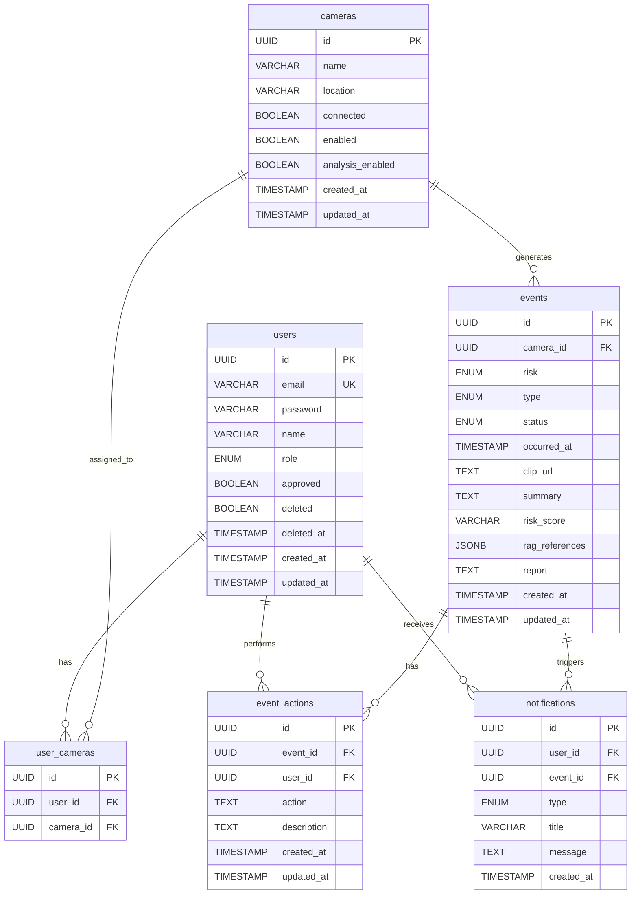

# AEGIS Backend

> Agent 기반 안전 모니터링 시스템 - 백엔드

## 개요

AEGIS Backend는 CCTV 모니터링 시스템의 REST API, 인증/인가, 실시간 알림, 미디어 서버 연동을 담당하는 Spring Boot 애플리케이션입니다.

## 기술 스택

| 분류        | 기술                               |
|-----------|----------------------------------|
| Framework | Spring Boot 3.5.9                |
| Language  | Java 21                          |
| Database  | PostgreSQL, Spring Data JPA      |
| Cache     | Redis, Spring Data Redis         |
| Security  | Spring Security, JWT (jjwt 0.12) |
| Storage   | AWS S3 SDK v2 (MinIO 호환)         |
| Docs      | SpringDoc OpenAPI 2.8            |
| Build     | Gradle 8.x                       |

## 프로젝트 구조

```
src/main/java/com/aegis/aegisbackend/
├── AegisBackendApplication.java    # 메인 클래스
├── domain/                         # 도메인 계층
│   ├── auth/                       # 인증
│   │   ├── controller/AuthController.java
│   │   ├── dto/AuthDto.java
│   │   └── service/AuthService.java
│   ├── camera/                     # 카메라
│   │   ├── controller/CameraController.java
│   │   ├── dto/CameraDto.java
│   │   ├── entity/Camera.java
│   │   ├── entity/UserCamera.java
│   │   ├── repository/CameraRepository.java
│   │   ├── repository/UserCameraRepository.java
│   │   └── service/CameraService.java
│   ├── event/                      # 이벤트
│   │   ├── controller/EventController.java
│   │   ├── controller/ActionController.java  # 액션 승인/거부 API
│   │   ├── dto/EventDto.java
│   │   ├── entity/Event.java
│   │   ├── entity/EventAction.java     # 이벤트 액션 로그
│   │   ├── repository/EventRepository.java
│   │   ├── repository/EventActionRepository.java
│   │   ├── repository/EventSpecification.java  # 동적 필터링 쿼리
│   │   └── service/EventService.java
│   ├── notification/               # 알림
│   │   ├── controller/NotificationController.java
│   │   ├── dto/NotificationDto.java
│   │   ├── entity/Notification.java
│   │   ├── repository/NotificationRepository.java
│   │   ├── service/NotificationService.java
│   │   └── service/SseEmitterService.java
│   ├── stats/                      # 통계
│   │   ├── controller/StatsController.java
│   │   ├── dto/StatsDto.java
│   │   └── service/StatsService.java
│   ├── stream/                     # 스트림 (DTO만)
│   │   └── dto/StreamDto.java
│   └── user/                       # 사용자
│       ├── controller/UserController.java
│       ├── dto/UserDto.java
│       ├── entity/User.java
│       ├── repository/UserRepository.java
│       └── service/UserService.java
├── global/                         # 전역 설정
│   ├── common/
│   │   ├── dto/PageResponse.java
│   │   └── enums/
│   │       ├── EventRisk.java      # NORMAL, SUSPICIOUS, ABNORMAL
│   │       ├── EventStatus.java    # PROCESSING, ANALYZED
│   │       ├── EventType.java      # ASSAULT, BURGLARY, DUMP, SWOON, VANDALISM
│   │       ├── NotificationType.java # ALERT, WARNING, INFO, SUCCESS
│   │       └── UserRole.java       # USER, ADMIN
│   ├── config/
│   │   ├── AsyncConfig.java        # 비동기 설정
│   │   ├── DataInitializer.java    # 초기 Admin 생성
│   │   ├── OpenApiConfig.java      # Swagger 설정
│   │   ├── RedisConfig.java        # Redis 설정
│   │   ├── S3Config.java           # S3 설정
│   │   └── SecurityConfig.java     # Spring Security 설정
│   ├── exception/
│   │   ├── BusinessException.java
│   │   ├── ErrorCode.java
│   │   └── GlobalExceptionHandler.java
│   └── security/
│       ├── CustomUserDetailsService.java
│       ├── JwtAuthenticationFilter.java
│       └── JwtTokenProvider.java
└── infra/                          # 인프라 계층
    ├── agent/                      # AI Agent 연동
    │   ├── AgentWebhookController.java
    │   ├── dto/
    │   │   ├── CreateEventRequest.java
    │   │   ├── EventActionRequest.java
    │   │   ├── EventActionUpdateRequest.java
    │   │   ├── EventUpdateRequest.java
    │   │   └── PendingActionResponse.java
    │   └── service/
    │       └── PendingActionService.java
    ├── mediamtx/                   # MediaMTX 연동
    │   ├── MediaMTXSyncService.java
    │   └── MediaMTXWebhookController.java
    ├── redis/
    │   └── RedisTokenService.java
    └── s3/
        ├── S3Service.java
        └── TempClipCleanupScheduler.java
```

---

## 핵심 워크플로우

### 1. 카메라 동기화 흐름

```
1. MediaMTX에서 스트림 시작/종료 시 runOnReady/runOnNotReady 훅 실행
2. MediaMTX → POST /internal/mediamtx/sync 호출
3. MediaMTXSyncService:
   - GET /v3/paths/list로 MediaMTX API에서 스트림 목록 조회
   - DB의 카메라 목록과 비교
   - 새 스트림: INSERT (connected=true, enabled=false)
   - 기존 스트림: UPDATE connected 상태
   - 사라진 스트림: UPDATE connected=false
4. analysisEnabled=true인 카메라 목록을 Redis에 저장 (analysis:cameras)
5. Redis Pub/Sub으로 "camera:analysis:update" 채널에 "sync" 발행
6. SSE로 프론트엔드에 "camera" 이벤트 브로드캐스트
```

### 2. AI Agent 이벤트 생성 흐름

```
1. AI Agent → POST /internal/agent/events (1차 분석 결과)
   - Request: { cameraId, risk, type, occurredAt }
   - 이벤트 생성 (status=PROCESSING)
   - 알림 생성 (risk 기반 타입: abnormal→ALERT, suspicious→WARNING, normal→INFO)
   - SSE 브로드캐스트 (event)
   - Response: { eventId }

2. AI Agent → GET /internal/agent/events/{id}/clip/upload-url
   - S3 presigned PUT URL 생성 (clips/{eventId}.mp4, 10분 만료)
   - Response: { uploadUrl }

3. AI Agent → presigned URL로 MinIO에 직접 업로드

4. AI Agent → POST /internal/agent/events/{id}/clip/confirm
   - S3에서 클립 존재 확인 (clips/{eventId}.mp4)
   - Event.clipUrl 저장
   - SSE 브로드캐스트 (event)

5. AI Agent → PATCH /internal/agent/events/{id} (2차 분석 결과)
   - Request: { risk, type, summary, report, status }
   - null이 아닌 필드만 업데이트
   - 알림 생성 (수정된 risk 기반 타입)
   - SSE 브로드캐스트 (event)

6. AI Agent → POST /internal/agent/events/{id}/actions (액션 기록)
   - Request: { action, description }
   - 액션 로그 저장
   - 알림 생성 (이벤트 risk 기반 타입)
   - Response: { actionId }

7. AI Agent → PATCH /internal/agent/events/{id}/actions/{actionId} (액션 수정)
   - Request: { userId (선택), action, description }
   - userId가 있으면 승인/거절 사용자 업데이트
   - 알림 생성 (이벤트 risk 기반 타입)
   - Response: { actionId }

8. AI Agent → POST /internal/agent/events/{id}/actions/{actionId}/pending (Human-in-the-Loop)
   - Request: (없음)
   - DeferredResult로 응답 홀딩
   - 알림 생성 (이벤트 risk 기반 타입)
   - SSE "action-pending" 브로드캐스트
   - 사용자 승인/거부 시 응답 반환
   - Response: { userId, userName, userEmail, result }
```

### 2-1. Human-in-the-Loop 승인 흐름

```
AI Agent                         Spring                          Frontend
    |                               |                                |
    |-- POST /actions ------------>|                                |
    |<-- { actionId } -------------|                                |
    |                               |                                |
    |-- POST /actions/{id}/pending->|                                |
    |   (응답 홀딩)                  |-- SSE "action-pending" ------->|
    |                               |                                |
    |                               |   [승인/거부 UI 표시]            |
    |                               |                                |
    |                               |<-- POST /actions/{id}/resolve -|
    |                               |    { approved: true/false }    |
    |                               |                                |
    |<-- { userId, userName, ------|-- SSE "action-resolved" ------>|
    |      userEmail, result }     |                                |
```

### 3. WebRTC 스트림 인증 흐름

```
1. 브라우저 → POST /stream/{camera}/whep (via Caddy)
   - Authorization: Basic base64("_:" + accessToken)

2. MediaMTX → POST /internal/mediamtx/auth (인증 위임)
   - Request: { user, password, action, path, protocol, ip }

3. MediaMTXWebhookController:
   - protocol별 분기:
     - SRT publish: ID/PW 검증
     - WebRTC read: password 필드의 JWT 검증 + 카메라 권한 확인
     - RTSP/HLS read: 인증 없음 (내부망)
   - 성공: 200 OK
   - 실패: 401 Unauthorized

4. 인증 성공 시 브라우저 ↔ MediaMTX WebRTC 연결 수립
```

### 4. 인증/토큰 관리 흐름

```
1. 로그인 (POST /api/auth/login):
   - 이메일/비밀번호 검증
   - Access Token 생성 (15분)
   - Refresh Token 생성 (7일)
   - Redis에 Refresh Token 저장 (key: refresh_token:{token}, value: userId)
   - Cookie에 Refresh Token 설정 (HttpOnly, Secure)
   - Response: { accessToken, user }

2. API 요청:
   - Authorization: Bearer {accessToken}
   - JwtAuthenticationFilter에서 JWT 검증
   - SecurityContext에 인증 정보 설정

3. 토큰 갱신 (POST /api/auth/refresh):
   - Cookie에서 Refresh Token 추출
   - Redis에서 userId 조회
   - 새 Access Token 발급
   - Response: { accessToken }

4. 로그아웃 (POST /api/auth/logout):
   - Redis에서 Refresh Token 삭제
   - Cookie 삭제
```

### 5. SSE 알림 시스템

```
1. 클라이언트 연결 (GET /api/notifications/stream):
   - SseEmitter 생성 (타임아웃: 30분)
   - 사용자별 Map에 저장
   - "connect" 이벤트 전송
   - 현재 pending 액션 목록 전송

2. 이벤트 발생 시:
   - NotificationService: DB에 알림 저장
   - SseEmitterService.broadcast*(): 모든 연결된 클라이언트에 전송

3. 이벤트 타입:
   - notification: 새 알림 (토스트 표시)
   - camera: 카메라 상태 변경
   - event: 이벤트 생성/수정
   - event-deleted: 이벤트 삭제
   - member: 멤버 변경
   - action-update: 액션 생성/수정 (모달 갱신)
   - action-pending: 액션 승인 대기 (Human-in-the-Loop)
   - action-resolved: 액션 승인/거부 완료

4. 연결 종료/오류 시:
   - Map에서 Emitter 제거
   - 클라이언트 재연결 필요
```

---

## 핵심 서비스 상세

### AuthService

| 메서드                | 기능      | 특이사항                                        |
|--------------------|---------|---------------------------------------------|
| `signup()`         | 회원가입    | approved=false로 생성, 관리자 승인 필요               |
| `login()`          | 로그인     | approved/deleted 검증, Refresh Token Redis 저장 |
| `logout()`         | 로그아웃    | Redis에서 Refresh Token 삭제                    |
| `refresh()`        | 토큰 갱신   | Cookie의 Refresh Token으로 Access Token 재발급    |
| `changePassword()` | 비밀번호 변경 | 현재 비밀번호 확인 후 변경                             |
| `deleteAccount()`  | 회원 탈퇴   | 소프트 삭제 (deleted=true, deletedAt 기록)         |

### CameraService

| 메서드                            | 기능        | 특이사항                                     |
|--------------------------------|-----------|------------------------------------------|
| `getCamerasPaged()`            | 카메라 목록    | 권한별 필터링, 정렬: connected→enabled→location  |
| `updateCamera()`               | 카메라 수정    | location, enabled, analysisEnabled 수정 가능 |
| `syncAnalysisCamerasToRedis()` | Redis 동기화 | analysisEnabled=true 카메라를 Redis에 저장      |

### EventService

| 메서드                | 기능     | 특이사항                                   |
|--------------------|--------|----------------------------------------|
| `getEventsPaged()` | 이벤트 목록 | 권한별 필터링 (Admin: 전체, User: 할당 카메라만)     |
| `deleteEvent()`    | 이벤트 삭제 | S3 클립 삭제 → 알림 삭제 → 이벤트 삭제 → SSE 브로드캐스트 |

### MediaMTXSyncService

| 메서드             | 기능      | 특이사항                           |
|-----------------|---------|--------------------------------|
| `syncCameras()` | 카메라 동기화 | Redis Lock으로 중복 실행 방지 (1초 TTL) |

### S3Service

| 메서드                     | 기능          | 특이사항                          |
|-------------------------|-------------|-------------------------------|
| `generateUploadUrl()`   | 업로드 URL 생성  | clips/{eventId}.mp4, 10분 만료   |
| `generateDownloadUrl()` | 다운로드 URL 생성 | Caddy 도메인으로 서명                |
| `clipExists()`          | 클립 존재 확인    | clips/{eventId}.mp4 확인        |
| `downloadClip()`        | 클립 다운로드     | byte[] 반환                     |
| `deleteClip()`          | 클립 삭제       | 이벤트 삭제 시 호출                   |
| `cleanupTempClips()`    | 임시 클립 정리    | 스케줄러에서 호출 (현재 temp/clips 미사용) |

---

## 설치 및 실행

```bash
# 빌드
./gradlew build

# 실행
./gradlew bootRun

# 테스트
./gradlew test
```

## 환경 변수

`application.properties` 또는 환경 변수로 설정:

| 변수                       | 설명                    | 기본값                                      |
|--------------------------|-----------------------|------------------------------------------|
| `DB_URL`                 | PostgreSQL URL        | `jdbc:postgresql://localhost:5432/aegis` |
| `DB_USERNAME`            | DB 사용자                | `aegis`                                  |
| `DB_PASSWORD`            | DB 비밀번호               | `trillion`                               |
| `REDIS_HOST`             | Redis 호스트             | `localhost`                              |
| `REDIS_PORT`             | Redis 포트              | `6379`                                   |
| `REDIS_PASSWORD`         | Redis 비밀번호            | (빈 문자열)                                  |
| `AWS_S3_ACCESS_KEY`      | S3 Access Key         | `aegis`                                  |
| `AWS_S3_SECRET_KEY`      | S3 Secret Key         | `trillion`                               |
| `AWS_S3_REGION`          | S3 리전                 | `us-east-1`                              |
| `AWS_S3_BUCKET`          | S3 버킷                 | `aegis`                                  |
| `AWS_S3_ENDPOINT`        | S3 엔드포인트 (MinIO용)     | `http://localhost:9000`                  |
| `JWT_SECRET`             | JWT 서명 키 (256bit 이상)  | (개발용 기본값)                                |
| `JWT_ACCESS_EXPIRATION`  | Access Token 만료 (ms)  | `900000` (15분)                           |
| `JWT_REFRESH_EXPIRATION` | Refresh Token 만료 (ms) | `604800000` (7일)                         |
| `MEDIAMTX_API_URL`       | MediaMTX API URL      | `http://localhost:9997`                  |
| `MEDIAMTX_WEBRTC_URL`    | WebRTC WHEP 기본 경로     | `/stream`                                |
| `MEDIAMTX_SRT_USER`      | SRT 인증 사용자            | `aegis`                                  |
| `MEDIAMTX_SRT_PASSWORD`  | SRT 인증 비밀번호           | `trillion`                               |
| `ADMIN_EMAIL`            | 초기 Admin 이메일          | `admin@aegis.local`                      |
| `ADMIN_PASSWORD`         | 초기 Admin 비밀번호         | `changeyourpassword`                     |
| `ADMIN_NAME`             | 초기 Admin 이름           | `Admin`                                  |

## API 명세

### Auth API (`/api/auth`)

| Method | Path        | 설명      |
|--------|-------------|---------|
| POST   | `/signup`   | 회원가입    |
| POST   | `/login`    | 로그인     |
| POST   | `/logout`   | 로그아웃    |
| POST   | `/refresh`  | 토큰 갱신   |
| GET    | `/me`       | 내 정보 조회 |
| PATCH  | `/me`       | 프로필 수정  |
| PATCH  | `/password` | 비밀번호 변경 |
| DELETE | `/me`       | 회원 탈퇴   |

#### POST /api/auth/signup

**Request:**

```json
{
  "email": "string (필수, 이메일 형식)",
  "password": "string (필수, 6자 이상)",
  "name": "string (필수, 100자 이하)"
}
```

**Response:** `200 OK`

```json
{
  "success": true,
  "message": "회원가입이 완료되었습니다. 관리자 승인 후 로그인이 가능합니다."
}
```

#### POST /api/auth/login

**Request:**

```json
{
  "email": "string (필수)",
  "password": "string (필수)"
}
```

**Response:** `200 OK`

```json
{
  "accessToken": "JWT 토큰",
  "user": {
    "id",
    "email",
    "name",
    "role",
    "assignedCameras",
    "createdAt",
    "approved"
  }
}
```

**Cookie:** `refreshToken` (HttpOnly, Secure, 7일)

#### POST /api/auth/refresh

**Cookie:** `refreshToken` 필요

**Response:** `200 OK`

```json
{
  "accessToken": "새 JWT 토큰"
}
```

#### PATCH /api/auth/password

**Request:**

```json
{
  "currentPassword": "string (필수)",
  "newPassword": "string (필수, 6자 이상)"
}
```

### Camera API (`/api/cameras`)

| Method | Path    | 설명                          |
|--------|---------|-----------------------------|
| GET    | `/`     | 카메라 목록 (페이지네이션, 기본 size=6)  |
| GET    | `/all`  | 카메라 전체 목록 (멤버 관리 - 카메라 할당용) |
| GET    | `/{id}` | 카메라 상세                      |
| PATCH  | `/{id}` | 카메라 수정                      |

**정렬 순서**: `connected DESC` → `enabled DESC` → `location ASC`

#### GET /api/cameras

**Response:** `200 OK` (PageResponse)

```json
{
  "content": [
    {
      "id": "UUID",
      "name": "카메라명 (MediaMTX 원본)",
      "location": "장소",
      "connected": true,
      "enabled": true,
      "analysisEnabled": true,
      "streamUrl": "/stream/{name}/whep"
    }
  ],
  "page": 0,
  "size": 6,
  "totalElements": 10,
  "totalPages": 2,
  "first": true,
  "last": false
}
```

#### GET /api/cameras/all

**Response:** `200 OK`

```json
[
  {
    "id": "UUID",
    "name": "카메라명",
    "location": "장소",
    "connected": true,
    "enabled": true,
    "analysisEnabled": true,
    "streamUrl": "/stream/{name}/whep"
  }
]
```

#### GET /api/cameras/{id}

**Response:** `200 OK`

```json
{
  "id": "UUID",
  "name": "카메라명",
  "location": "장소",
  "connected": true,
  "enabled": true,
  "analysisEnabled": true,
  "streamUrl": "/stream/{name}/whep"
}
```

#### PATCH /api/cameras/{id}

**Request:**

```json
{
  "location": "string (선택)",
  "enabled": "boolean (선택)",
  "analysisEnabled": "boolean (선택)"
}
```

**Response:** `200 OK`

```json
{
  "id": "UUID",
  "name": "카메라명",
  "location": "장소",
  "connected": true,
  "enabled": true,
  "analysisEnabled": true,
  "streamUrl": "/stream/{name}/whep"
}
```

### Event API (`/api/events`)

| Method | Path                   | 설명                          |
|--------|------------------------|-----------------------------|
| GET    | `/`                    | 이벤트 목록 (페이지네이션, 기본 size=20) |
| GET    | `/{id}`                | 이벤트 상세                      |
| GET    | `/{id}/report`         | 보고서 HTML 조회                 |
| DELETE | `/{id}`                | 이벤트 삭제 (Admin)              |
| GET    | `/{id}/clip-url`       | 클립 재생용 presigned URL        |
| GET    | `/{id}/clip/download-url` | 클립 다운로드용 presigned URL   |
| POST   | `/{id}/actions/{actionId}/resolve` | 액션 승인/거부 (Human-in-the-Loop) |

#### GET /api/events

**Query Parameters:**
| 파라미터 | 타입 | 설명 |
|----------|------|------|
| `page` | int | 페이지 번호 (기본: 0) |
| `size` | int | 페이지 크기 (기본: 20) |
| `risks` | string[] | 위험도 필터 (suspicious, abnormal) |
| `types` | string[] | 이상행동 유형 (assault, burglary, dump, swoon, vandalism) |
| `statuses` | string[] | 분석 상태 (processing, analyzed) |
| `cameraIds` | string[] | 카메라 ID 목록 |
| `startDate` | datetime | 시작 날짜 (ISO 8601) |
| `endDate` | datetime | 종료 날짜 (ISO 8601) |

> `_empty` 마커를 전송하면 해당 필터에서 결과 없음 반환 (전체 해제)

**Response:** `200 OK` (PageResponse)

```json
{
  "content": [
    {
      "id": "UUID",
      "cameraId": "UUID",
      "cameraName": "카메라명",
      "cameraLocation": "설치 장소",
      "risk": "normal | suspicious | abnormal",
      "type": "assault | burglary | dump | swoon | vandalism",
      "occurredAt": "2026-01-31T12:00:00",
      "status": "processing | analyzed",
      "clipUrl": "S3 URL (nullable)",
      "summary": "AI 요약 (nullable)",
      "actions": "[{...}] (nullable)",
      "report": "상세 보고서 (nullable)"
    }
  ],
  "page": 0,
  "size": 20,
  "totalElements": 100,
  "totalPages": 5,
  "first": true,
  "last": false
}
```

#### GET /api/events/{id}/report

**Response:** `200 OK` (Content-Type: text/html)

```html
<!DOCTYPE html>
<html>
<head>...</head>
<body>
<!-- AI Agent가 생성한 분석 보고서 HTML -->
</body>
</html>
```

**Error:** `404 Not Found` (보고서가 없는 경우)

#### GET /api/events/{id}/clip-url

클립 재생용 presigned URL 반환

**Response:** `200 OK`

```json
{
  "url": "https://... (presigned URL)"
}
```

**Error:** `404 Not Found` (클립이 없는 경우)

#### GET /api/events/{id}/clip/download-url

클립 다운로드용 presigned URL 반환

**Response:** `200 OK`

```json
{
  "url": "https://... (presigned URL)",
  "filename": "event_{id}.mp4"
}
```

**Error:** `404 Not Found` (클립이 없는 경우)

#### POST /api/events/{id}/actions/{actionId}/resolve

액션 승인/거부 (Human-in-the-Loop)

**Request:**

```json
{
  "approved": boolean
}
```

**Response:** `200 OK`

```json
{
  "success": true
}
```

**Error:** `400 Bad Request` (액션을 찾을 수 없거나 이미 처리됨)

### Notification API (`/api/notifications`)

| Method | Path      | 설명     |
|--------|-----------|--------|
| GET    | `/stream` | SSE 연결 |
| GET    | `/`       | 알림 목록  |
| DELETE | `/`       | 전체 삭제  |

#### GET /api/notifications

**Response:** `200 OK`

```json
[
  {
    "id": "UUID",
    "type": "alert | warning | info | success",
    "title": "알림 제목",
    "message": "알림 메시지",
    "timestamp": "2026-01-31T12:00:00",
    "eventId": "UUID (nullable)"
  }
]
```

#### DELETE /api/notifications

**Response:** `200 OK`

```json
{
  "success": true
}
```

### Stats API (`/api/stats`)

| Method | Path                 | 설명                 |
|--------|----------------------|--------------------|
| GET    | `/`                  | 전체 통계 (type 미지정 시) |
| GET    | `/?type=daily`       | 일별 통계 (주간)         |
| GET    | `/?type=event-types` | 유형별 통계             |
| GET    | `/?type=monthly`     | 월별 통계              |

#### GET /api/stats?type=daily

**Response:** `200 OK`

```json
[
  {
    "day": "일",
    "events": 5,
    "resolved": 3
  },
  {
    "day": "월",
    "events": 8,
    "resolved": 6
  }
]
```

#### GET /api/stats?type=event-types

**Response:** `200 OK`

```json
[
  {
    "type": "assault",
    "count": 10,
    "color": "#ef4444"
  },
  {
    "type": "burglary",
    "count": 5,
    "color": "#f97316"
  }
]
```

#### GET /api/stats?type=monthly

**Response:** `200 OK`

```json
{
  "2026-01-15": {
    "events": 5,
    "alerts": 2
  },
  "2026-01-16": {
    "events": 3,
    "alerts": 1
  }
}
```

### User API (`/api/users`) - Admin 전용

| Method | Path             | 설명                         |
|--------|------------------|----------------------------|
| GET    | `/`              | 승인된 사용자 목록 (최신 가입순)        |
| GET    | `/pending`       | 미승인 사용자 목록 (최신 가입순)        |
| GET    | `/pending/count` | 미승인 사용자 수                  |
| GET    | `/{id}`          | 사용자 상세                     |
| PATCH  | `/{id}`          | 사용자 수정 (어드민은 카메라 권한 수정 불가) |
| DELETE | `/{id}`          | 사용자 삭제                     |
| PATCH  | `/{id}/approve`  | 사용자 승인                     |

#### GET /api/users

승인된 사용자 목록 조회 (최신 가입순 정렬)

**Response:** `200 OK` (PageResponse)

```json
{
  "content": [
    {
      "id": "UUID",
      "email": "user@example.com",
      "name": "사용자명",
      "role": "user | admin",
      "approved": true,
      "assignedCameras": [
        "UUID 배열"
      ],
      "createdAt": "2026-01-31T12:00:00"
    }
  ],
  "page": 0,
  "size": 20,
  "totalElements": 10,
  "totalPages": 1,
  "first": true,
  "last": true
}
```

#### GET /api/users/{id}

**Response:** `200 OK`

```json
{
  "id": "UUID",
  "email": "user@example.com",
  "name": "사용자명",
  "role": "user | admin",
  "approved": true,
  "assignedCameras": [
    "UUID 배열"
  ],
  "createdAt": "2026-01-31T12:00:00"
}
```

#### PATCH /api/users/{id}

> 어드민 사용자는 카메라 권한(assignedCameras) 수정 불가

**Request:**

```json
{
  "name": "string (선택)",
  "role": "user | admin (선택)",
  "assignedCameras": [
    "카메라 UUID 배열 (선택)"
  ]
}
```

**Response:** `200 OK`

```json
{
  "id": "UUID",
  "email": "user@example.com",
  "name": "사용자명",
  "role": "user | admin",
  "approved": true,
  "assignedCameras": [
    "UUID 배열"
  ],
  "createdAt": "2026-01-31T12:00:00"
}
```

#### DELETE /api/users/{id}

**Response:** `200 OK`

```json
{
  "success": true
}
```

#### PATCH /api/users/{id}/approve

**Response:** `200 OK`

```json
{
  "id": "UUID",
  "email": "user@example.com",
  "name": "사용자명",
  "role": "user | admin",
  "approved": true,
  "assignedCameras": [
    "UUID 배열"
  ],
  "createdAt": "2026-01-31T12:00:00"
}
```

### Internal API (내부망 전용)

#### Agent Webhook (`/internal/agent`)

| Method | Path                                    | 설명                |
|--------|-----------------------------------------|-------------------|
| POST   | `/events`                               | 이벤트 생성            |
| PATCH  | `/events/{id}`                          | 이벤트 수정            |
| GET    | `/events/{id}/clip/upload-url`          | 클립 업로드 URL 발급     |
| POST   | `/events/{id}/clip/confirm`             | 클립 업로드 완료 확인      |
| POST   | `/events/{id}/actions`                  | 이벤트 액션 생성         |
| PATCH  | `/events/{id}/actions/{actionId}`       | 이벤트 액션 수정         |
| POST   | `/events/{id}/actions/{actionId}/pending` | 액션 승인 대기 (Human-in-the-Loop) |

##### POST /internal/agent/events

**Request:**

```json
{
  "cameraId": "UUID (필수)",
  "risk": "normal | suspicious | abnormal (필수)",
  "type": "assault | burglary | dump | swoon | vandalism (필수)",
  "occurredAt": "ISO8601 (선택, 기본 now)"
}
```

**Response:** `201 Created`

```json
{
  "eventId": "UUID"
}
```

##### POST /internal/agent/events/{id}/clip/confirm

clips/{eventId}.mp4 존재 확인 후 Event.clipUrl 저장

**Request:** Body 없음

**Response:** `200 OK`

```json
{
  "clipUrl": "clips/{eventId}.mp4"
}
```

##### PATCH /internal/agent/events/{id}

**Request:**

```json
{
  "risk": "normal | suspicious | abnormal (선택)",
  "type": "assault | burglary | dump | swoon | vandalism (선택)",
  "summary": "string (선택)",
  "report": "string (선택)",
  "status": "processing | analyzed (선택)"
}
```

**Response:** `200 OK`

```json
{
  "eventId": "UUID"
}
```

##### GET /internal/agent/events/{id}/clip/upload-url

클립 업로드를 위한 S3 presigned URL 발급

**Request:** Body 없음

**Response:** `200 OK`

```json
{
  "uploadUrl": "https://..."
}
```

##### POST /internal/agent/events/{id}/actions

이벤트 액션 생성

**Request:**

```json
{
  "action": "string (필수) - 액션 종류",
  "description": "string (필수) - 액션 설명"
}
```

**Response:** `201 Created`

```json
{
  "actionId": "UUID"
}
```

##### PATCH /internal/agent/events/{id}/actions/{actionId}

이벤트 액션 수정

**Request:**

```json
{
  "userId": "UUID (선택) - 승인/거절한 사용자",
  "action": "string (필수)",
  "description": "string (필수)"
}
```

**Response:** `200 OK`

```json
{
  "actionId": "UUID"
}
```

##### POST /internal/agent/events/{id}/actions/{actionId}/pending

액션 승인 대기 (Human-in-the-Loop)

DeferredResult를 사용하여 사용자 응답까지 HTTP 연결 유지

**Request:** Body 없음

**Response:** `200 OK` (사용자 승인/거부 후 반환)

```json
{
  "userId": "UUID",
  "userName": "string",
  "userEmail": "string",
  "result": true/false
}
```

#### MediaMTX Webhook (`/internal/mediamtx`)

| Method | Path    | 설명                   |
|--------|---------|----------------------|
| POST   | `/sync` | 카메라 동기화 트리거          |
| POST   | `/auth` | 스트림 인증 (MediaMTX 호출) |

##### POST /internal/mediamtx/auth

MediaMTX에서 호출하는 인증 요청:

**Request:**

```json
{
  "user": "사용자명",
  "password": "비밀번호 또는 JWT",
  "action": "publish | read",
  "path": "카메라 경로",
  "protocol": "srt | rtsp | hls | webrtc",
  "ip": "클라이언트 IP"
}
```

**인증 규칙:**

- `SRT publish`: ID/PW 검증
- `WebRTC read`: JWT 검증 + 카메라 권한 확인
- `RTSP/HLS read`: 인증 없음 (내부망)

## 데이터 모델

### ERD



### 테이블 상세

#### users

| 컬럼         | 타입           | 제약조건             | 기본값   | 설명          |
|------------|--------------|------------------|-------|-------------|
| id         | UUID         | PK               | auto  | 고유 식별자      |
| email      | VARCHAR(255) | UNIQUE, NOT NULL | -     | 로그인 이메일     |
| password   | VARCHAR(255) | NOT NULL         | -     | BCrypt 암호화  |
| name       | VARCHAR(100) | NOT NULL         | -     | 사용자 이름      |
| role       | ENUM         | NOT NULL         | USER  | USER, ADMIN |
| approved   | BOOLEAN      | NOT NULL         | false | 관리자 승인 여부   |
| deleted    | BOOLEAN      | NOT NULL         | false | 탈퇴 여부       |
| deleted_at | TIMESTAMP    | -                | NULL  | 탈퇴 일시       |
| created_at | TIMESTAMP    | NOT NULL         | auto  | 가입일         |
| updated_at | TIMESTAMP    | NOT NULL         | auto  | 수정일         |

#### cameras

| 컬럼               | 타입           | 제약조건     | 기본값   | 설명               |
|------------------|--------------|----------|-------|------------------|
| id               | UUID         | PK       | auto  | 고유 식별자           |
| name             | VARCHAR(50)  | NOT NULL | -     | MediaMTX 스트림 경로명 |
| location         | VARCHAR(100) | NOT NULL | =name | 사용자 지정 장소        |
| connected        | BOOLEAN      | NOT NULL | false | MediaMTX 연결 상태   |
| enabled          | BOOLEAN      | NOT NULL | false | 카메라 활성화          |
| analysis_enabled | BOOLEAN      | NOT NULL | false | AI 분석 활성화        |
| created_at       | TIMESTAMP    | NOT NULL | auto  | 생성일              |
| updated_at       | TIMESTAMP    | NOT NULL | auto  | 수정일              |

#### user_cameras

| 컬럼        | 타입   | 제약조건            | 설명     |
|-----------|------|-----------------|--------|
| id        | UUID | PK              | 고유 식별자 |
| user_id   | UUID | FK → users.id   | 사용자    |
| camera_id | UUID | FK → cameras.id | 카메라    |

#### events

| 컬럼             | 타입          | 제약조건            | 기본값        | 설명                                        |
|----------------|-------------|-----------------|------------|-------------------------------------------|
| id             | UUID        | PK              | auto       | 고유 식별자                                    |
| camera_id      | UUID        | FK → cameras.id | -          | 카메라                                       |
| risk           | ENUM        | NOT NULL        | -          | NORMAL, SUSPICIOUS, ABNORMAL              |
| type           | ENUM        | NOT NULL        | -          | ASSAULT, BURGLARY, DUMP, SWOON, VANDALISM |
| status         | ENUM        | NOT NULL        | PROCESSING | PROCESSING, ANALYZED                      |
| occurred_at    | TIMESTAMP   | NOT NULL        | -          | 발생 시각                                     |
| clip_url       | TEXT        | -               | NULL       | S3 클립 URL                                 |
| summary        | TEXT        | -               | NULL       | AI 요약                                     |
| risk_score     | VARCHAR(10) | -               | NULL       | 위험 점수                                     |
| rag_references | JSONB       | -               | NULL       | RAG 참조                                    |
| report         | TEXT        | -               | NULL       | 상세 보고서                                    |
| created_at     | TIMESTAMP   | NOT NULL        | auto       | 생성일                                       |
| updated_at     | TIMESTAMP   | NOT NULL        | auto       | 수정일                                       |

#### event_actions

| 컬럼          | 타입        | 제약조건                     | 기본값  | 설명                      |
|-------------|-----------|--------------------------|------|-------------------------|
| id          | UUID      | PK                       | auto | 고유 식별자                  |
| event_id    | UUID      | FK → events.id, NOT NULL | -    | 이벤트                     |
| user_id     | UUID      | FK → users.id            | NULL | 액션 승인/거절한 사용자 (null이면 자동) |
| action      | TEXT      | NOT NULL                 | -    | 액션 종류 또는 이름             |
| description | TEXT      | NOT NULL                 | -    | 액션 실행 결과 또는 설명          |
| created_at  | TIMESTAMP | NOT NULL                 | auto | 생성일                     |
| updated_at  | TIMESTAMP | NOT NULL                 | auto | 수정일                     |

#### notifications

| 컬럼         | 타입           | 제약조건                    | 설명                            |
|------------|--------------|-------------------------|-------------------------------|
| id         | UUID         | PK                      | 고유 식별자                        |
| user_id    | UUID         | FK → users.id, NOT NULL | 수신 사용자                        |
| event_id   | UUID         | FK → events.id          | 관련 이벤트 (nullable)             |
| type       | ENUM         | NOT NULL                | ALERT, WARNING, INFO, SUCCESS |
| title      | VARCHAR(200) | NOT NULL                | 제목                            |
| message    | TEXT         | NOT NULL                | 메시지                           |
| created_at | TIMESTAMP    | NOT NULL                | 생성일                           |

### 인덱스

| 테이블           | 인덱스명                         | 컬럼               |
|---------------|------------------------------|------------------|
| users         | idx_users_email              | email            |
| users         | idx_users_approved           | approved         |
| cameras       | idx_cameras_connected        | connected        |
| cameras       | idx_cameras_enabled          | enabled          |
| cameras       | idx_cameras_analysis_enabled | analysis_enabled |
| events        | idx_events_camera_id         | camera_id        |
| events        | idx_events_risk              | risk             |
| events        | idx_events_type              | type             |
| events        | idx_events_status            | status           |
| events        | idx_events_occurred_at       | occurred_at      |
| event_actions | idx_event_actions_event_id   | event_id         |
| notifications | idx_notifications_user_id    | user_id          |
| notifications | idx_notifications_created_at | created_at       |

## 인증/인가

### JWT 토큰

- **Access Token**: 15분, Authorization 헤더
- **Refresh Token**: 7일, HttpOnly Cookie, Redis 저장

### Spring Security FilterChain

1. `JwtAuthenticationFilter`: JWT 검증 및 SecurityContext 설정
2. 인증 예외 경로: `/api/auth/login`, `/api/auth/signup`, `/api/auth/refresh`, `/internal/**`

### 권한

- `USER`: 기본 사용자 (할당된 카메라만 접근)
- `ADMIN`: 모든 카메라 접근 (카메라 권한 수정 불가), 사용자 관리

## SSE 알림 시스템

### SseEmitterService

- 사용자별 SSE 연결 관리
- 타임아웃: 30분

### 이벤트 타입

| 이벤트             | 설명                      |
|-----------------|-------------------------|
| `connect`       | 연결 성공                   |
| `notification`  | 새 알림                    |
| `camera`        | 카메라 상태 변경               |
| `event`         | 이벤트 생성/수정               |
| `event-deleted` | 이벤트 삭제                  |
| `member`        | 멤버 변경                   |
| `action-pending` | 액션 승인 대기 (Human-in-the-Loop) |
| `action-resolved` | 액션 해결됨                 |

## 에러 코드

### Auth

| 코드                        | HTTP | 메시지                       |
|---------------------------|------|---------------------------|
| EMAIL_NOT_FOUND           | 401  | 등록되지 않은 이메일입니다.           |
| INVALID_PASSWORD          | 401  | 비밀번호가 일치하지 않습니다.          |
| USER_NOT_APPROVED         | 403  | 관리자 승인 대기 중입니다.           |
| DUPLICATE_EMAIL           | 400  | 이미 등록된 이메일입니다.            |
| REFRESH_TOKEN_NOT_FOUND   | 401  | Refresh token이 없습니다.      |
| INVALID_REFRESH_TOKEN     | 401  | 유효하지 않은 refresh token입니다. |
| INVALID_USER              | 401  | 유효하지 않은 사용자입니다.           |
| AUTHENTICATION_REQUIRED   | 401  | 인증이 필요합니다.                |
| USER_NOT_FOUND            | 401  | 사용자를 찾을 수 없습니다.           |
| CURRENT_PASSWORD_MISMATCH | 400  | 현재 비밀번호가 일치하지 않습니다.       |
| PASSWORD_TOO_SHORT        | 400  | 새 비밀번호는 6자 이상이어야 합니다.     |
| USER_DELETED              | 403  | 탈퇴한 계정입니다.                |

### User

| 코드                   | HTTP | 메시지             |
|----------------------|------|-----------------|
| USER_ID_REQUIRED     | 400  | 사용자 ID가 필요합니다.  |
| USER_NOT_FOUND_BY_ID | 404  | 사용자를 찾을 수 없습니다. |

### Camera

| 코드                   | HTTP | 메시지                     |
|----------------------|------|-------------------------|
| CAMERA_NOT_FOUND     | 404  | 카메라를 찾을 수 없습니다.         |
| CAMERA_ACCESS_DENIED | 403  | 해당 카메라에 대한 접근 권한이 없습니다. |
| CAMERA_NOT_CONNECTED | 400  | 카메라가 연결되어 있지 않습니다.      |

### Event

| 코드              | HTTP | 메시지             |
|-----------------|------|-----------------|
| EVENT_NOT_FOUND | 404  | 이벤트를 찾을 수 없습니다. |

### S3/Clip

| 코드                     | HTTP | 메시지              |
|------------------------|------|------------------|
| S3_UPLOAD_FAILED       | 500  | S3 업로드에 실패했습니다.  |
| S3_DOWNLOAD_FAILED     | 500  | S3 다운로드에 실패했습니다. |
| S3_DELETE_FAILED       | 500  | S3 삭제에 실패했습니다.   |
| CLIP_EXTRACTION_FAILED | 500  | 클립 추출에 실패했습니다.   |

### General

| 코드                    | HTTP | 메시지               |
|-----------------------|------|-------------------|
| FORBIDDEN             | 403  | 권한이 없습니다.         |
| INTERNAL_SERVER_ERROR | 500  | 서버 내부 오류가 발생했습니다. |

## 외부 연동

### MediaMTX

- **카메라 동기화**: `/internal/mediamtx/sync` 호출 시 MediaMTX API에서 스트림 목록 조회 후 DB 동기화
- **인증 위임**: MediaMTX → `/internal/mediamtx/auth` 호출
    - WebRTC read: JWT 검증
    - SRT publish: ID/PW 검증
    - RTSP/HLS read: 인증 없음 (내부망)

### S3 (MinIO)

- 클립 저장/조회/삭제
- 버킷: `aegis` (기본값, 환경변수 `AWS_S3_BUCKET`으로 변경 가능)
- 키 형식: `clips/{eventId}.mp4`

**클립 저장 구조:**

```
aegis/
└── clips/                  # 이벤트 클립 (Agent가 presigned URL로 직접 업로드)
    └── {event_id}.mp4
```

**참고**: `temp/clips/` 경로와 관련 메서드(`tempClipExists`, `moveClipFromTemp`)는 현재 사용되지 않습니다 (Known Issues 참조).

### Redis

| 키                       | 타입     | 밸류                                                     | TTL | 설명                        |
|-------------------------|--------|--------------------------------------------------------|-----|---------------------------|
| `refresh_token:{token}` | String | `userId (UUID)`                                        | 7일  | Refresh Token → 사용자 매핑    |
| `mediamtx:sync:lock`    | String | `"locked"`                                             | 1초  | MediaMTX 동기화 중복 방지 잠금     |
| `analysis:cameras`      | String | `[{"id":"uuid","name":"cam1","location":"1층 로비"},...]` | 없음  | AI 분석 대상 카메라 목록 (JSON 배열) |

**Pub/Sub 채널:**

| 채널                       | 메시지      | 설명                                |
|--------------------------|----------|-----------------------------------|
| `camera:analysis:update` | `"sync"` | 분석 카메라 목록 변경 알림 (Python Agent 구독) |

## 빌드 및 배포

### JAR 빌드

```bash
./gradlew bootJar
java -jar build/libs/aegis-backend-1.0.0.jar
```

### Docker 배포

Caddy 리버스 프록시를 통해 `/api/*` 경로로 서비스됩니다.

- 내부 포트: 8080
- 외부 접근: `https://localhost/api/*`

---

## 🐛 Known Issues

> 최종 감사일: 2026-02-12

### 고아 코드

| 파일               | 문제                       | 상세                           |
|------------------|--------------------------|------------------------------|
| `S3Service.java` | `tempClipExists()` 미사용   | temp/clips 경로 확인 메서드, 호출처 없음 |
| `S3Service.java` | `moveClipFromTemp()` 미사용 | temp → clips 이동 메서드, 호출처 없음  |

### 미구현 코드

| 파일             | 기능     | 현재 상태                      |
|----------------|--------|----------------------------|
| `Event.report` | 상세 보고서 | 필드만 존재, AI Agent에서 생성하지 않음 |

### 보안 이슈

| 파일                       | 문제                | 심각도   | 권장 조치                       |
|--------------------------|-------------------|-------|-----------------------------|
| `application.properties` | JWT Secret 기본값 사용 | 🔴 높음 | 환경 변수로 주입, 256bit 이상 랜덤값 사용 |
| `DataInitializer.java`   | Admin 비밀번호 기본값    | 🟡 중간 | 환경 변수로 주입 또는 첫 로그인 시 변경 강제  |
| `/internal/**` 경로        | 인증 없음 (내부망 가정)    | 🟡 중간 | 운영환경에서 IP 화이트리스트 적용         |

### 기타

| 항목         | 설명                                               |
|------------|--------------------------------------------------|
| SSE 타임아웃   | SseEmitterService 30분 타임아웃, 재연결 필요               |
| 카메라 삭제 미지원 | MediaMTX 스트림 종료 시 connected=false만 처리, 삭제 API 없음 |

