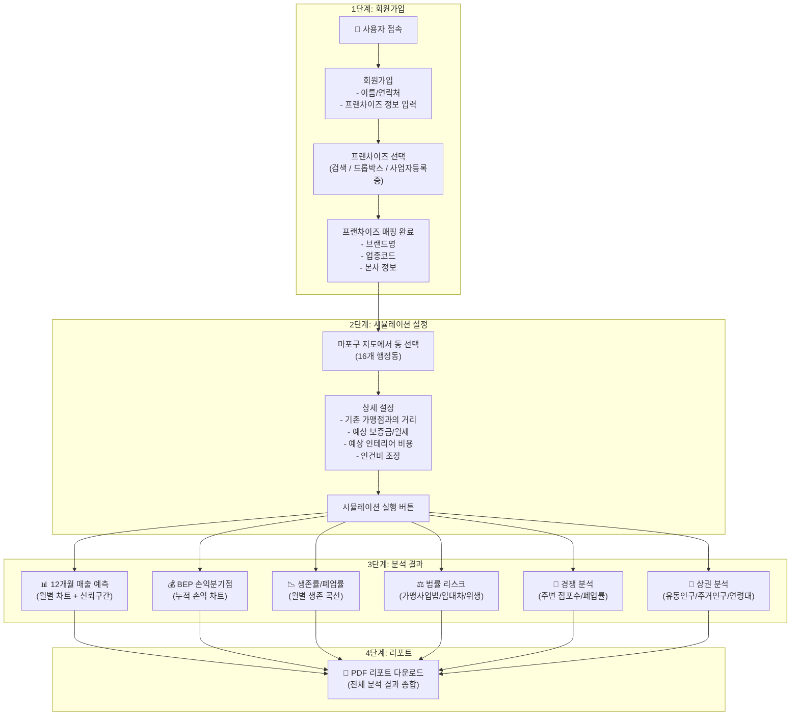
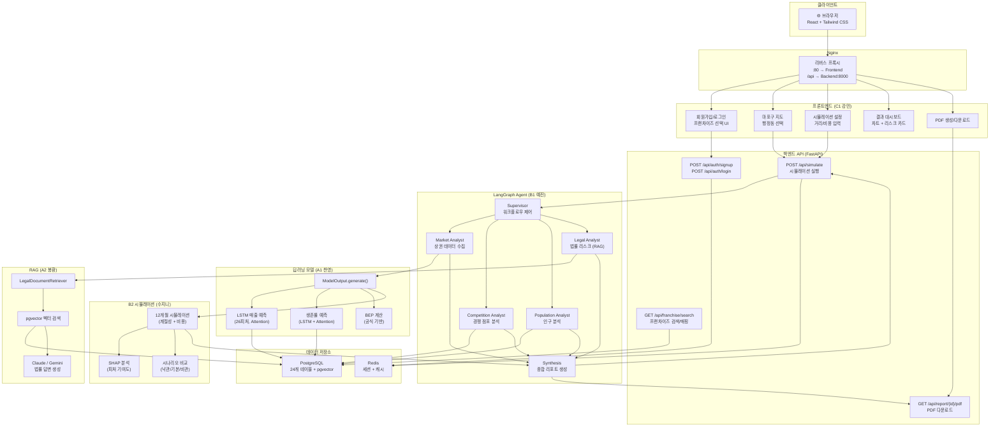
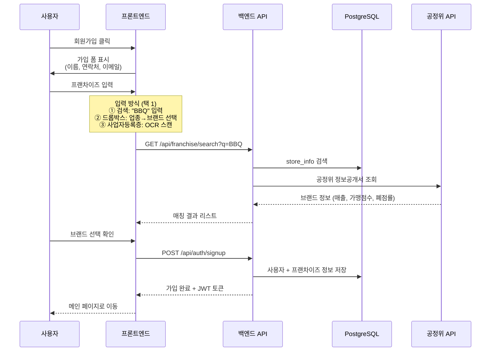
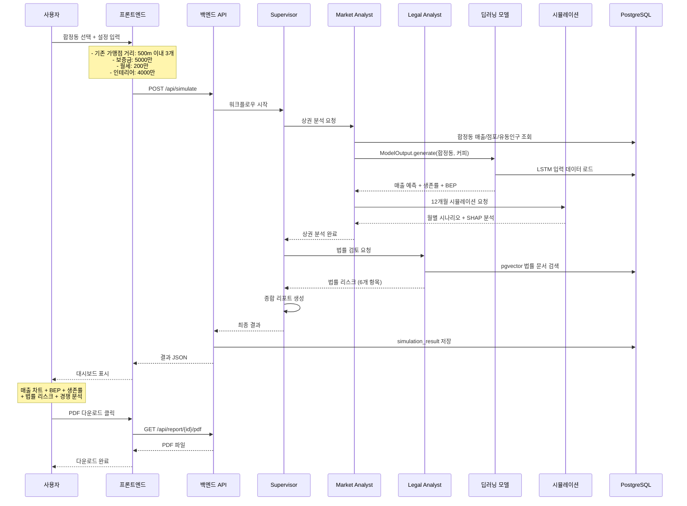
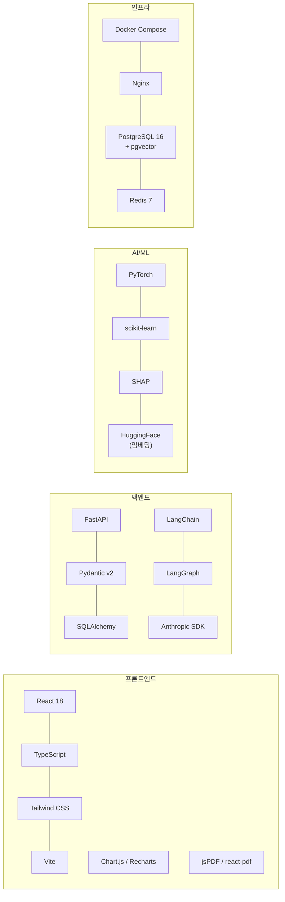

# 마포구 프랜차이즈 상권분석 시뮬레이터 — 서비스 아키텍처

## 1. 사용자 여정 (User Journey)

## 2. 시스템 아키텍처

## 3. 회원가입 + 프랜차이즈 매핑 상세

## 4. 시뮬레이션 실행 상세

## 5. PDF 리포트 구조

```mermaid
graph TD
    subgraph "PDF 리포트"
        P0["📄 표지<br/>마포구 프랜차이즈 상권분석 리포트<br/>합정동 × 커피-음료<br/>생성일: 2026-04-09"]

        P1["1. 입지 요약<br/>- 선택 행정동: 합정동<br/>- 업종: 커피-음료<br/>- 브랜드: OO커피<br/>- 기존 가맹점: 500m 이내 3개"]

        P2["2. 매출 예측<br/>📊 12개월 월별 매출 차트<br/>- 월평균: 4,720만원<br/>- 연매출: 5.66억원<br/>- 신뢰구간: ±10%"]

        P3["3. 손익분기점(BEP)<br/>💰 누적 손익 차트<br/>- BEP: 18개월<br/>- 초기투자: 1.3억원<br/>- 월순이익: 280만원<br/>- ROI: 25.8%"]

        P4["4. 생존률 분석<br/>📉 12개월 생존 곡선<br/>- 1년 생존률: 72%<br/>- 리스크: safe<br/>- 동일 업종 평균 폐업률: 12%"]

        P5["5. 경쟁 환경<br/>🏪 주변 점포 현황<br/>- 동일 업종: 40개<br/>- 프랜차이즈: 25개<br/>- 최근 개업: 5개/분기<br/>- 최근 폐업: 3개/분기"]

        P6["6. 상권 분석<br/>👥 인구/트렌드<br/>- 유동인구: 32,000명/일<br/>- 주거인구: 33,150명<br/>- 2030 비율: 45%<br/>- 네이버 트렌드: 하락(-42%)"]

        P7["7. 법률 리스크<br/>⚖️ 항목별 판정<br/>- 가맹사업법: ⚠️ 주의<br/>- 상가임대차: ✅ 안전<br/>- 식품위생: ⚠️ 주의<br/>- 용도지역: ✅ 안전<br/>- 다중이용업소: ✅ 안전<br/>- 공정위 정보공개서: ✅ 안전"]

        P8["8. SHAP 분석<br/>🔍 매출 기여 요인<br/>- 유동인구: +1,800만<br/>- 주거인구: +900만<br/>- 경쟁점포: -600만<br/>- 임대료: -400만<br/>- 트렌드: -200만"]

        P9["9. 종합 의견<br/>AI Agent 종합 판정<br/>- 추천도: ★★★★☆<br/>- 핵심 리스크: 경쟁 과열<br/>- 권고사항: ..."]
    end

    P0 --> P1 --> P2 --> P3 --> P4 --> P5 --> P6 --> P7 --> P8 --> P9
```

## 6. 기술 스택

## 7. API 엔드포인트

| Method | Path | 설명 | 담당 |
|--------|------|------|------|
| POST | `/api/auth/signup` | 회원가입 (프랜차이즈 정보 포함) | C1+C2 |
| POST | `/api/auth/login` | 로그인 | C1+C2 |
| GET | `/api/franchise/search` | 프랜차이즈 검색 | B1 |
| GET | `/api/franchise/{id}` | 프랜차이즈 상세 (공정위 정보공개서) | A2 |
| POST | `/api/simulate` | 시뮬레이션 실행 | B1 |
| GET | `/api/simulate/{id}` | 시뮬레이션 결과 조회 | B1 |
| GET | `/api/report/{id}/pdf` | PDF 리포트 다운로드 | B2+C1 |
| GET | `/api/districts` | 마포구 16개 동 목록 | A1 |
| GET | `/api/districts/{code}/stats` | 동별 통계 (매출/인구/점포) | A1 |
