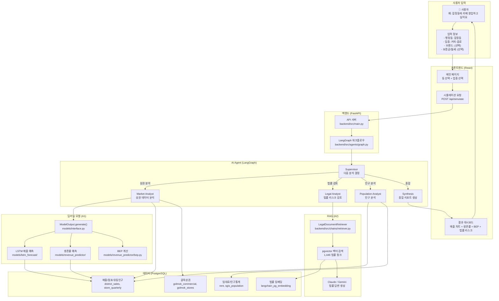
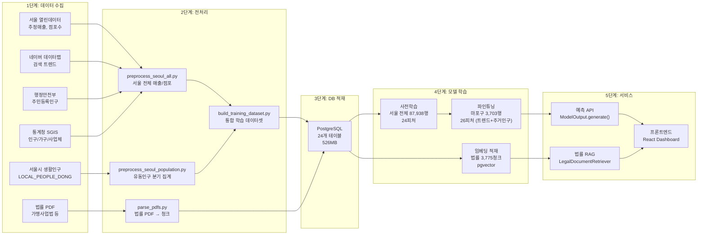
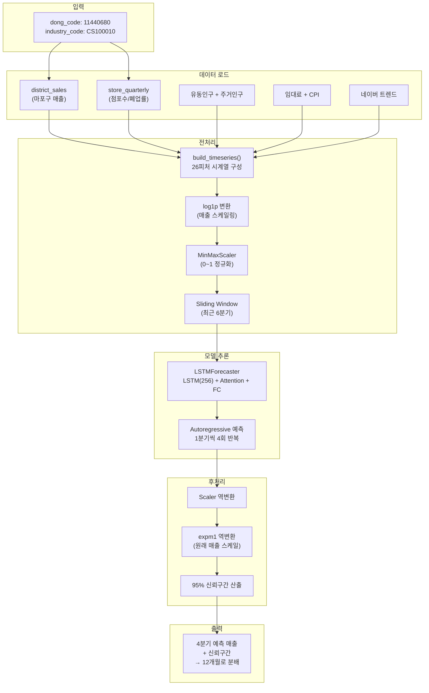
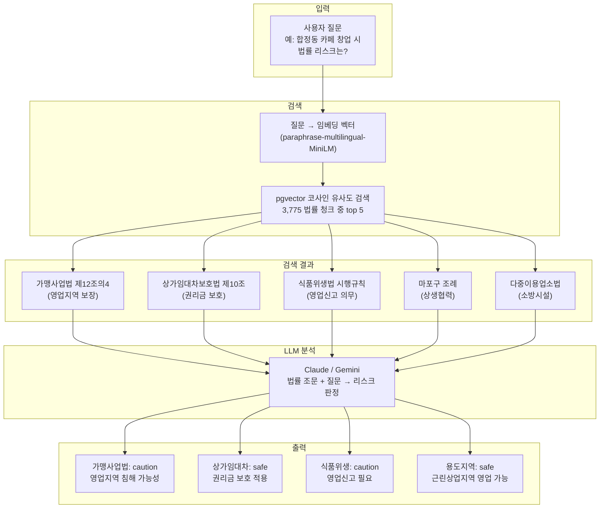
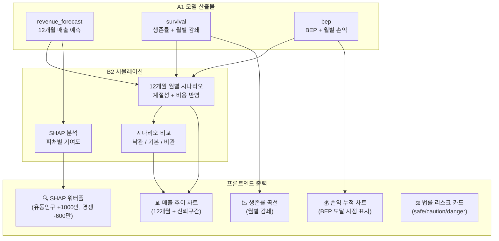
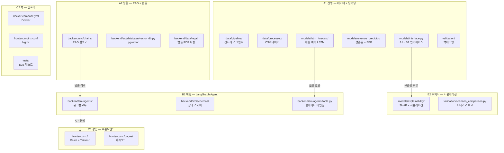

# 마포구 프랜차이즈 상권분석 시뮬레이터 — 전체 시스템 흐름

## 1. 사용자 관점 전체 흐름

```mermaid
graph TD
    subgraph "사용자 입력"
        U1["🧑 사용자<br/>예: 합정동에 카페 창업하고 싶어요"]
        U2["입력 정보<br/>- 행정동: 합정동<br/>- 업종: 커피-음료<br/>- 브랜드: (선택)<br/>- 보증금/월세: (선택)"]
    end

    subgraph "프론트엔드 (React)"
        FE1["메인 페이지<br/>동 선택 + 업종 선택"]
        FE2["시뮬레이션 요청<br/>POST /api/simulate"]
        FE3["결과 대시보드<br/>매출 차트 + 생존률 + BEP + 법률 리스크"]
    end

    subgraph "백엔드 (FastAPI)"
        API["API 서버<br/>backend/src/main.py"]
        GRAPH["LangGraph 워크플로우<br/>backend/src/agents/graph.py"]
    end

    subgraph "AI Agent (LangGraph)"
        SUP["Supervisor<br/>다음 분석 결정"]
        MA["Market Analyst<br/>상권 데이터 분석"]
        LA["Legal Analyst<br/>법률 리스크 검토"]
        PA["Population Analyst<br/>인구 분석"]
        SYN["Synthesis<br/>종합 리포트 생성"]
    end

    subgraph "딥러닝 모델 (A1)"
        LSTM["LSTM 매출 예측<br/>models/lstm_forecast/"]
        SURV["생존률 예측<br/>models/revenue_predictor/"]
        BEP["BEP 계산<br/>models/revenue_predictor/bep.py"]
        INTF["ModelOutput.generate()<br/>models/interface.py"]
    end

    subgraph "RAG (A2)"
        RET["LegalDocumentRetriever<br/>backend/src/chains/retriever.py"]
        VDB["pgvector 벡터 검색<br/>1,446 법률 청크"]
        LLM["Claude / Gemini<br/>법률 답변 생성"]
    end

    subgraph "데이터 (PostgreSQL)"
        DB1["매출/점포/유동인구<br/>district_sales, store_quarterly"]
        DB2["골목상권<br/>golmok_commercial, golmok_stores"]
        DB3["임대료/인구통계<br/>rent, sgis_population"]
        DB4["법률 임베딩<br/>langchain_pg_embedding"]
    end

    U1 --> U2 --> FE1 --> FE2 --> API --> GRAPH
    GRAPH --> SUP
    SUP -->|상권 분석| MA
    SUP -->|법률 검토| LA
    SUP -->|인구 분석| PA
    SUP -->|종합| SYN
    MA --> INTF
    INTF --> LSTM
    INTF --> SURV
    INTF --> BEP
    LSTM --> DB1
    SURV --> DB1
    LA --> RET --> VDB --> DB4
    VDB --> LLM
    MA --> DB1
    MA --> DB2
    PA --> DB1
    PA --> DB3
    SYN --> FE3
    FE3 --> U1
```

## 2. 데이터 수집 → 학습 → 서비스 파이프라인

```mermaid
graph LR
    subgraph "1단계: 데이터 수집"
        SRC1["서울 열린데이터<br/>추정매출, 점포수"]
        SRC2["서울시 생활인구<br/>LOCAL_PEOPLE_DONG"]
        SRC3["네이버 데이터랩<br/>검색 트렌드"]
        SRC4["행정안전부<br/>주민등록인구"]
        SRC5["통계청 SGIS<br/>인구/가구/사업체"]
        SRC6["법률 PDF<br/>가맹사업법 등"]
    end

    subgraph "2단계: 전처리"
        PP1["preprocess_seoul_all.py<br/>서울 전체 매출/점포"]
        PP2["preprocess_seoul_population.py<br/>유동인구 분기 집계"]
        PP3["build_training_dataset.py<br/>통합 학습 데이터셋"]
        PP4["parse_pdfs.py<br/>법률 PDF → 청크"]
    end

    subgraph "3단계: DB 적재"
        DB["PostgreSQL<br/>24개 테이블<br/>526MB"]
    end

    subgraph "4단계: 모델 학습"
        PT["사전학습<br/>서울 전체 87,938행<br/>24피처"]
        FT["파인튜닝<br/>마포구 3,703행<br/>26피처 (트렌드+주거인구)"]
        EMB["임베딩 적재<br/>법률 3,775청크<br/>pgvector"]
    end

    subgraph "5단계: 서비스"
        PRED["예측 API<br/>ModelOutput.generate()"]
        RAG["법률 RAG<br/>LegalDocumentRetriever"]
        FE["프론트엔드<br/>React Dashboard"]
    end

    SRC1 --> PP1
    SRC2 --> PP2
    SRC3 --> PP1
    SRC4 --> PP1
    SRC5 --> PP1
    SRC6 --> PP4
    PP1 --> PP3
    PP2 --> PP3
    PP3 --> DB
    PP4 --> DB
    DB --> PT --> FT --> PRED
    DB --> EMB --> RAG
    PRED --> FE
    RAG --> FE
```

## 3. LSTM 매출 예측 상세 흐름

```mermaid
graph TD
    subgraph "입력"
        IN["dong_code: 11440680<br/>industry_code: CS100010"]
    end

    subgraph "데이터 로드"
        LD1["district_sales<br/>(마포구 매출)"]
        LD2["store_quarterly<br/>(점포수/폐업률)"]
        LD3["유동인구 + 주거인구"]
        LD4["임대료 + CPI"]
        LD5["네이버 트렌드"]
    end

    subgraph "전처리"
        BT["build_timeseries()<br/>26피처 시계열 구성"]
        LOG["log1p 변환<br/>(매출 스케일링)"]
        SC["MinMaxScaler<br/>(0~1 정규화)"]
        WIN["Sliding Window<br/>(최근 6분기)"]
    end

    subgraph "모델 추론"
        MDL["LSTMForecaster<br/>LSTM(256) + Attention + FC"]
        AR["Autoregressive 예측<br/>1분기씩 4회 반복"]
    end

    subgraph "후처리"
        ISC["Scaler 역변환"]
        ILOG["expm1 역변환<br/>(원래 매출 스케일)"]
        CI["95% 신뢰구간 산출"]
    end

    subgraph "출력"
        OUT["4분기 예측 매출<br/>+ 신뢰구간<br/>→ 12개월로 분배"]
    end

    IN --> LD1
    IN --> LD2
    LD1 --> BT
    LD2 --> BT
    LD3 --> BT
    LD4 --> BT
    LD5 --> BT
    BT --> LOG --> SC --> WIN --> MDL --> AR
    AR --> ISC --> ILOG --> CI --> OUT
```

## 4. 법률 RAG 상세 흐름

```mermaid
graph TD
    subgraph "입력"
        Q["사용자 질문<br/>예: 합정동 카페 창업 시<br/>법률 리스크는?"]
    end

    subgraph "검색"
        EMB["질문 → 임베딩 벡터<br/>(paraphrase-multilingual-MiniLM)"]
        VEC["pgvector 코사인 유사도 검색<br/>3,775 법률 청크 중 top 5"]
    end

    subgraph "검색 결과"
        D1["가맹사업법 제12조의4<br/>(영업지역 보장)"]
        D2["상가임대차보호법 제10조<br/>(권리금 보호)"]
        D3["식품위생법 시행규칙<br/>(영업신고 의무)"]
        D4["마포구 조례<br/>(상생협력)"]
        D5["다중이용업소법<br/>(소방시설)"]
    end

    subgraph "LLM 분석"
        LLM["Claude / Gemini<br/>법률 조문 + 질문 → 리스크 판정"]
    end

    subgraph "출력"
        R1["가맹사업법: caution<br/>영업지역 침해 가능성"]
        R2["상가임대차: safe<br/>권리금 보호 적용"]
        R3["식품위생: caution<br/>영업신고 필요"]
        R4["용도지역: safe<br/>근린상업지역 영업 가능"]
    end

    Q --> EMB --> VEC
    VEC --> D1
    VEC --> D2
    VEC --> D3
    VEC --> D4
    VEC --> D5
    D1 --> LLM
    D2 --> LLM
    D3 --> LLM
    D4 --> LLM
    D5 --> LLM
    LLM --> R1
    LLM --> R2
    LLM --> R3
    LLM --> R4
```

## 5. B2 시뮬레이션 흐름 (수지니 영역)

```mermaid
graph TD
    subgraph "A1 모델 산출물"
        RF["revenue_forecast<br/>12개월 매출 예측"]
        SV["survival<br/>생존률 + 월별 감쇄"]
        BP["bep<br/>BEP + 월별 손익"]
    end

    subgraph "B2 시뮬레이션"
        S12["12개월 월별 시나리오<br/>계절성 + 비용 반영"]
        SHAP["SHAP 분석<br/>피처별 기여도"]
        SC["시나리오 비교<br/>낙관 / 기본 / 비관"]
    end

    subgraph "프론트엔드 출력"
        C1["📊 매출 추이 차트<br/>(12개월 + 신뢰구간)"]
        C2["📉 생존률 곡선<br/>(월별 감쇄)"]
        C3["💰 손익 누적 차트<br/>(BEP 도달 시점 표시)"]
        C4["🔍 SHAP 워터폴<br/>(유동인구 +1800만, 경쟁 -600만)"]
        C5["⚖️ 법률 리스크 카드<br/>(safe/caution/danger)"]
    end

    RF --> S12
    SV --> S12
    BP --> S12
    RF --> SHAP
    S12 --> SC
    S12 --> C1
    SV --> C2
    BP --> C3
    SHAP --> C4
    SC --> C1
```

## 6. 팀원별 담당 영역

```mermaid
graph TB
    subgraph "A1 찬영 — 데이터 + 딥러닝"
        A1_1["data/pipeline/<br/>전처리 스크립트"]
        A1_2["data/processed/<br/>CSV 데이터"]
        A1_3["models/lstm_forecast/<br/>매출 예측 LSTM"]
        A1_4["models/revenue_predictor/<br/>생존률 + BEP"]
        A1_5["models/interface.py<br/>A1→B2 인터페이스"]
        A1_6["validation/<br/>백테스팅"]
    end

    subgraph "A2 봉환 — RAG + 법률"
        A2_1["backend/src/chains/<br/>RAG 검색기"]
        A2_2["backend/src/database/vector_db.py<br/>pgvector"]
        A2_3["backend/data/legal/<br/>법률 PDF 파싱"]
    end

    subgraph "B1 예진 — LangGraph Agent"
        B1_1["backend/src/agents/<br/>워크플로우"]
        B1_2["backend/src/schemas/<br/>상태 스키마"]
        B1_3["backend/src/agents/tools.py<br/>실데이터 바인딩"]
    end

    subgraph "B2 수지니 — 시뮬레이션"
        B2_1["models/explainability/<br/>SHAP + 시뮬레이션"]
        B2_2["validation/scenario_comparison.py<br/>시나리오 비교"]
    end

    subgraph "C1 강민 — 프론트엔드"
        C1_1["frontend/src/<br/>React + Tailwind"]
        C1_2["frontend/src/pages/<br/>대시보드"]
    end

    subgraph "C2 혁 — 인프라"
        C2_1["docker-compose.yml<br/>Docker"]
        C2_2["frontend/nginx.conf<br/>Nginx"]
        C2_3["tests/<br/>E2E 테스트"]
    end

    A1_5 -->|산출물 전달| B2_1
    A2_1 -->|법률 검색| B1_1
    B1_1 -->|API 응답| C1_1
    A1_3 -->|모델 호출| B1_3
```
