# 마포구 프랜차이즈 상권분석 시뮬레이터 — DB ERD

> DB: `mapo_simulator` | **88개 테이블** (alembic_version 포함)
> 출처: `backend/src/database/models.py` + DB 실측 (information_schema)
> 최종 갱신: 2026-05-04
>
> 자동 재생성: `python backend/scripts/diagnostics/gen_db_schema_doc.py`

---

## 통계

| 항목 | 값 |
|---|---|
| 테이블 | 88 |
| 컬럼 | 1,152 |
| Foreign Key | 44 |
| ORM 모델 정의 | 78 |
| 도메인 분류 | 12 |

---

## 도메인 분류

| 도메인 | 테이블 수 | 대표 테이블 |
|---|---|---|
| 서울 행정동 (`seoul_adstrd_*`) | 4 | flpop, fclty, stor, change_ix |
| 서울 시군구 (`seoul_signgu_*`) | 5 | selng, stor, flpop, fclty, change_ix |
| 서울 상권 (`seoul_trdar_*`) | 3 | flpop, fclty, change_ix |
| 서울 전역 | 13 | district_sales, dong_master, training_dataset, golmok_rent, subway_passenger_daily, ttareungi_usage_daily, imputed_v4 |
| 마포 전용 | 3 | resident_pop, schools, sns_sentiment |
| 카카오 외부수집 | 3 | kakao_store, kakao_store_hours, kakao_store_menu |
| 네이버 외부수집 | 4 | naver_vacancy, naver_trend_industry/monthly/quarterly |
| 통계청 SGIS | 3 | sgis_population, sgis_household, sgis_business |
| 공공 통계 | 4 | kosis_regional_income, ecos_*, molit_nrg_trade |
| 법률 RAG | 2 | law_legislations, law_precedents |
| Vector DB | 2 | langchain_pg_collection, langchain_pg_embedding |
| 마스터 | 6 | dong_mapping, dong_centroid, industry_master, master_subway_station, master_ttareungi_station, holiday_calendar, jeonse_dong_master |
| 회원/인증 | 6 | users, manager_users, invite_codes, password_reset_tokens, user_usage, biz_brand_mapping |
| 시뮬 결과/고객 | 3 | simulation_ai, simulation_foresee, customers |
| 프로덕션 데이터 | 22 | district_sales, store_quarterly, store_info, ftc_brand_franchise, living_population, living_population_grid, mart_brand_territory, ... |

---

## ER 다이어그램 — 핵심 관계 (FK 기반)

```mermaid
erDiagram
    %% ========== 마스터 (참조 hub) ==========
    industry_master {
        varchar industry_code PK
        varchar industry_name
    }
    dong_mapping {
        varchar dong_code PK "마포 16동"
        varchar dong_name
    }
    seoul_dong_master {
        varchar dong_code PK "서울 전역 431동"
        varchar dong_name
        varchar sgg_code
    }
    jeonse_dong_master {
        varchar dong_code PK
        varchar dong_name
    }
    master_subway_station {
        varchar station_code PK
        varchar station_name
    }
    master_ttareungi_station {
        varchar station_id PK
        varchar dong_code FK
    }

    %% ========== 마포 코어 (dong_mapping 참조) ==========
    district_sales {
        int quarter PK
        varchar dong_code PK,FK
        varchar industry_code PK,FK
    }
    store_quarterly {
        int quarter PK
        varchar dong_code PK,FK
        varchar industry_code PK,FK
    }
    store_info {
        varchar store_id PK
        varchar dong_code FK
    }
    living_population {
        date date PK
        int time_zone PK
        varchar dong_code PK,FK
    }
    living_population_grid {
        varchar cell_id PK
        date ymd PK
        varchar dong_code FK
    }
    mapo_resident_pop {
        varchar dong_code FK
    }
    golmok_commercial {
        int id PK
        varchar industry_code FK
    }
    golmok_rent {
        int id PK
        varchar dong_code FK
    }
    golmok_sales {
        int quarter PK
        varchar trdar_code PK
        varchar industry_code PK,FK
    }
    golmok_stores {
        int quarter PK
        varchar trdar_code PK
        varchar industry_code PK,FK
    }

    %% ========== 서울 전역 (seoul_dong_master 참조) ==========
    seoul_district_sales {
        int quarter PK
        varchar dong_code PK,FK
        varchar industry_code PK,FK
    }
    seoul_district_stores {
        varchar dong_code FK
        varchar industry_code FK
    }
    seoul_adstrd_stor {
        varchar dong_code FK
        varchar industry_code FK
    }
    seoul_adstrd_flpop {
        varchar dong_code FK
    }
    seoul_adstrd_change_ix {
        varchar dong_code FK
    }
    seoul_signgu_stor {
        varchar industry_code FK
    }
    seoul_signgu_selng {
        varchar industry_code FK
    }
    seoul_population_quarterly {
        varchar dong_code FK
    }
    seoul_resident_pop_quarterly {
        varchar dong_code FK
    }
    seoul_dong_migration_monthly {
        varchar dong_code FK
    }
    seoul_golmok_rent {
        varchar dong_code FK
    }
    seoul_training_dataset {
        varchar dong_code FK
        varchar industry_code FK
    }
    seoul_subway_passenger_daily {
        varchar station_code FK
    }
    seoul_ttareungi_usage_daily {
        varchar station_id FK
    }

    %% ========== 카카오 (자체 클러스터) ==========
    kakao_store {
        varchar kakao_id PK
        varchar place_name
        varchar category
    }
    kakao_store_hours {
        varchar kakao_id PK,FK
    }
    kakao_store_menu {
        int id PK
        varchar kakao_id FK
    }

    %% ========== 회원 ==========
    users {
        varchar id PK
        varchar email
        varchar biz_number
    }
    invite_codes {
        int id PK
        varchar owner_id FK
    }
    manager_users {
        varchar id PK
        varchar owner_id FK
        int invite_code_id FK
    }
    password_reset_tokens {
        int id PK
        varchar user_id FK
    }
    user_usage {
        int id PK
        varchar user_id FK
    }

    %% ========== Vector DB ==========
    langchain_pg_collection {
        uuid uuid PK
    }
    langchain_pg_embedding {
        bigint id PK
        uuid collection_id FK
    }

    %% ========== 임대료 ==========
    jeonse_monthly_rent {
        int id PK
        varchar dong_code FK
    }
    dong_subway_access {
        varchar dong_name PK
        varchar dong_code FK
    }

    %% ========== 관계 ==========
    dong_mapping ||--o{ district_sales : "dong_code"
    dong_mapping ||--o{ store_quarterly : "dong_code"
    dong_mapping ||--o{ store_info : "dong_code"
    dong_mapping ||--o{ living_population : "dong_code"
    dong_mapping ||--o{ living_population_grid : "dong_code"
    dong_mapping ||--o{ mapo_resident_pop : "dong_code"
    dong_mapping ||--o{ golmok_rent : "dong_code"
    dong_mapping ||--o{ seoul_adstrd_fclty : "dong_code"

    industry_master ||--o{ district_sales : "industry_code"
    industry_master ||--o{ store_quarterly : "industry_code"
    industry_master ||--o{ golmok_commercial : "industry_code"
    industry_master ||--o{ golmok_sales : "industry_code"
    industry_master ||--o{ golmok_stores : "industry_code"
    industry_master ||--o{ seoul_district_sales : "industry_code"
    industry_master ||--o{ seoul_district_stores : "industry_code"
    industry_master ||--o{ seoul_adstrd_stor : "industry_code"
    industry_master ||--o{ seoul_signgu_stor : "industry_code"
    industry_master ||--o{ seoul_signgu_selng : "industry_code"
    industry_master ||--o{ seoul_training_dataset : "industry_code"

    seoul_dong_master ||--o{ seoul_district_sales : "dong_code"
    seoul_dong_master ||--o{ seoul_district_stores : "dong_code"
    seoul_dong_master ||--o{ seoul_adstrd_change_ix : "dong_code"
    seoul_dong_master ||--o{ seoul_adstrd_flpop : "dong_code"
    seoul_dong_master ||--o{ seoul_adstrd_stor : "dong_code"
    seoul_dong_master ||--o{ seoul_population_quarterly : "dong_code"
    seoul_dong_master ||--o{ seoul_resident_pop_quarterly : "dong_code"
    seoul_dong_master ||--o{ seoul_dong_migration_monthly : "dong_code"
    seoul_dong_master ||--o{ seoul_golmok_rent : "dong_code"
    seoul_dong_master ||--o{ seoul_training_dataset : "dong_code"
    seoul_dong_master ||--o{ dong_subway_access : "dong_code"
    seoul_dong_master ||--o{ master_ttareungi_station : "dong_code"

    jeonse_dong_master ||--o{ jeonse_monthly_rent : "dong_code"
    master_subway_station ||--o{ seoul_subway_passenger_daily : "station_code"
    master_ttareungi_station ||--o{ seoul_ttareungi_usage_daily : "station_id"

    kakao_store ||--o{ kakao_store_hours : "kakao_id"
    kakao_store ||--o{ kakao_store_menu : "kakao_id"

    users ||--o{ invite_codes : "owner_id"
    users ||--o{ manager_users : "owner_id"
    users ||--o{ password_reset_tokens : "user_id"
    users ||--o{ user_usage : "user_id"
    invite_codes ||--o{ manager_users : "invite_code_id"

    langchain_pg_collection ||--o{ langchain_pg_embedding : "collection_id"
```

---

## ⚠️ FK 이중 master 혼선

`dong_code` 컬럼이 두 마스터를 가리키는 테이블 분포:

### `dong_mapping` (마포 16동) 참조
- `district_sales` (3,703 rows)
- `store_quarterly` (3,840)
- `store_info` (30,488)
- `living_population` (961,071)
- `living_population_grid` (10.5M)
- `mapo_resident_pop` (408)
- `golmok_rent` (472)
- `seoul_adstrd_fclty` (336) ⚠️ **혼선** — 다른 seoul_adstrd_* 는 seoul_dong_master 참조

### `seoul_dong_master` (서울 431동) 참조
- `seoul_adstrd_change_ix` (11,900)
- `seoul_adstrd_flpop` (11,900)
- `seoul_adstrd_stor` (849,552)
- `seoul_district_sales` (87,938)
- `seoul_district_stores` (100,587)
- `seoul_population_quarterly` (10,176)
- `seoul_resident_pop_quarterly` (13,508)
- `seoul_dong_migration_monthly` (1,360)
- `seoul_golmok_rent` (11,900)
- `seoul_training_dataset` (87,938)

**가이드**:
- 마포 한정 데이터 = `dong_mapping` (16개 row 만)
- 서울 전역 데이터 = `seoul_dong_master` (431개 row)
- `seoul_adstrd_fclty` 는 마포 한정으로 적재되어 `dong_mapping` 참조 — 의도적이지만 헷갈림. 향후 `seoul_dong_master` 통일 또는 컬럼 주석 명시 권장.

---

## ⚠️ ORM-DB 격차

### Zombie (ORM 정의, DB 없음) — 3개
- `BrandLogo` → `brand_logo` (DB 없음)
- `SimulationResult` → `simulation_result` (DB 없음 — `simulation_ai`/`simulation_foresee` 로 대체)
- `SimulationHistory` → `simulation_history` (DB 없음)

### DB only (raw SQL 의존) — 12개
- `industry_master` ⚠️ **9개 FK 가리키는 hub. ORM 모델 추가 시급**
- `living_population_grid` (10.5M rows — 가장 큰 테이블)
- `langchain_pg_collection`, `langchain_pg_embedding` (vector RAG)
- `mart_brand_territory` (11,849 — brand 영업지역 마트)
- `seoul_district_sales_imputed_v4`, `_v4_detail`
- `seoul_resident_pop_quarterly`
- `mapo_schools`, `password_reset_tokens`, `user_usage` (모두 0 row)
- `alembic_version` (메타)

---

## 다음 액션

1. **`industry_master` ORM 추가** — 9 FK 정합 (A1 영역)
2. **Zombie 모델 3개 정리** — BrandLogo / SimulationResult / SimulationHistory 삭제 또는 마이그레이션 추가
3. **`mart_brand_territory` ORM 추가** (11,849 row 마트 데이터)
4. **`relationship()` 도입** — explicit join 부담 줄이기 (선택)
5. **`dong_code` 이중 master 가이드 문서화**

상세는 [audit-2026-05-04.md](audit-2026-05-04.md) 참조.
