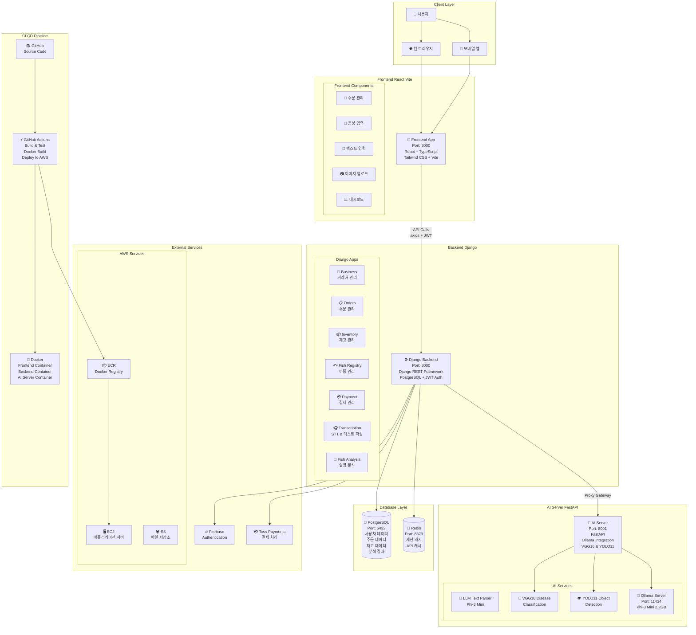

# 🏗️ Team-PICK-O 시스템 아키텍처

## 📋 시스템 개요

Team-PICK-O는 수산물 도매업체를 위한 AI 기반 주문 관리 및 어류 질병 분석 시스템입니다.

## 🏛️ 전체 아키텍처



## 🔧 기술 스택

### Frontend (포트: 3000)
- **프레임워크**: React 18 + TypeScript
- **빌드 도구**: Vite
- **스타일링**: Tailwind CSS
- **상태 관리**: React Hooks + Context API
- **HTTP 클라이언트**: Axios
- **인증**: Firebase Authentication + JWT

### Backend (포트: 8000)
- **프레임워크**: Django 4.2 + Django REST Framework
- **데이터베이스**: PostgreSQL
- **캐시**: Redis
- **인증**: JWT + Firebase Integration
- **파일 업로드**: Django File Handling
- **API 문서**: Django REST Framework Browsable API

### AI Server (포트: 8001)
- **프레임워크**: FastAPI
- **LLM**: Phi-3 Mini (2.2GB) via Ollama
- **컴퓨터 비전**: VGG16, YOLO11
- **이미지 처리**: OpenCV, PIL
- **STT**: Faster Whisper

### Database
- **Primary**: PostgreSQL 13+
- **Cache**: Redis 6+
- **File Storage**: AWS S3 (배포시)

## 📱 주요 기능

### 1. 주문 관리 시스템
- **음성 주문**: 음성 파일 업로드 → STT → LLM 파싱 → 구조화된 주문 데이터
- **텍스트 주문**: 자연어 텍스트 → LLM 파싱 → 주문 아이템 추출
- **이미지 주문**: OCR 기반 주문서 인식 (개발 예정)

### 2. AI 기반 텍스트 파싱
- **LLM 모델**: Microsoft Phi-3 Mini (3.8B 파라미터)
- **컨텍스트 인식**: 등록된 거래처명, 어종명 기반 매칭
- **Fuzzy Matching**: 유사도 기반 자동 매칭
- **검증 로직**: 매칭되지 않은 항목 별도 처리

### 3. 어류 질병 분석
- **객체 탐지**: YOLO11 기반 어류 탐지
- **질병 분류**: VGG16 기반 질병 분류
- **이미지 전처리**: 배경 제거, 크기 정규화

### 4. 거래처 & 재고 관리
- **거래처 관리**: CRUD, 미수금 관리
- **재고 관리**: 실시간 재고 추적, 부족 알림
- **어종 등록**: 표준화된 어종 데이터베이스

### 5. 결제 시스템
- **Toss Payments**: 온라인 결제
- **현금/계좌이체**: 수동 결제 처리
- **미수금 관리**: 거래처별 미수금 추적

## 🔄 주요 데이터 플로우

### 음성 주문 처리 플로우
```
1. 사용자 음성 파일 업로드
   ↓
2. Frontend → Backend (/api/v1/transcription/transcribe/)
   ↓
3. Faster Whisper STT 처리
   ↓
4. 텍스트 결과 Frontend 표시
   ↓
5. 사용자 "분석하기" 버튼 클릭
   ↓
6. Frontend → Backend (/api/v1/transcription/parse-text/)
   ↓
7. Backend → AI Server (/api/v1/text/parse-text)
   ↓
8. Ollama Phi-3 Mini LLM 파싱
   ↓
9. 데이터베이스 컨텍스트 기반 검증
   ↓
10. 구조화된 주문 데이터 반환
   ↓
11. Frontend에서 파싱 결과 표시
   ↓
12. 사용자 확인 후 "주문 목록에 추가"
```

### 질병 분석 플로우
```
1. 어류 이미지 업로드
   ↓
2. Frontend → Backend → AI Server
   ↓
3. ViT 기반 이미지 검증
   ↓
4. 배경 제거 전처리
   ↓
5. YOLO11 객체 탐지
   ↓
6. VGG16 질병 분류
   ↓
7. 분석 결과 반환 및 저장
```

## 🔒 보안 및 인증

### 인증 방식
- **Firebase Authentication**: 사용자 가입/로그인
- **JWT 토큰**: API 인증
- **토큰 갱신**: 자동 토큰 갱신 로직

### API 보안
- **CORS 설정**: 허용된 도메인만 접근
- **Rate Limiting**: API 호출 제한
- **Input Validation**: 모든 입력 데이터 검증

### 아키텍처 보안
- **AI Server 격리**: 백엔드를 통한 프록시 접근만 허용
- **내부 네트워크**: AI Server는 외부 포트 노출 안함

## 🚀 배포 환경

### Development
- **Frontend**: `npm run dev` (포트: 3000)
- **Backend**: `python manage.py runserver` (포트: 8000)
- **AI Server**: `uvicorn main:app` (포트: 8001)
- **Ollama**: `ollama serve` (포트: 11434)

### Production (AWS)
- **EC2**: Ubuntu 20.04 LTS
- **Docker Compose**: 멀티 컨테이너 오케스트레이션
- **Nginx**: 리버스 프록시 및 정적 파일 서빙
- **PostgreSQL**: RDS 또는 EC2 내 설치
- **Redis**: ElastiCache 또는 EC2 내 설치

### CI/CD Pipeline
- **GitHub Actions**: 자동 빌드, 테스트, 배포
- **ECR**: Docker 이미지 저장소
- **Blue-Green 배포**: 무중단 배포

## 📊 모니터링 및 로깅

### 로깅
- **Django Logging**: 구조화된 로그
- **AI Server Logging**: FastAPI 로그
- **Ollama Logging**: LLM 처리 로그

### 모니터링
- **Health Check**: 각 서비스별 헬스체크 엔드포인트
- **Performance Monitoring**: API 응답 시간 추적
- **Error Tracking**: 에러 로그 수집 및 알림

## 📈 성능 최적화

### Frontend
- **Code Splitting**: 라우트 기반 코드 분할
- **Image Optimization**: WebP 포맷 사용
- **Caching**: API 응답 캐싱

### Backend
- **Database Indexing**: 쿼리 최적화
- **Redis Caching**: 자주 조회되는 데이터 캐싱
- **Connection Pooling**: DB 연결 풀링

### AI Server
- **Model Caching**: 모델 메모리 상주
- **Batch Processing**: 여러 요청 배치 처리
- **GPU 최적화**: CUDA 활용 (GPU 환경시)

## 🔮 향후 계획

### 단기 (1-2개월)
- [ ] OCR 기반 이미지 주문 처리
- [ ] 실시간 알림 시스템
- [ ] 모바일 앱 개발

### 중기 (3-6개월)
- [ ] 더 큰 LLM 모델 적용 (Llama 3.1)
- [ ] 음성 인식 정확도 개선
- [ ] 예측 분석 기능

### 장기 (6개월+)
- [ ] 멀티 테넌트 아키텍처
- [ ] 마이크로서비스 분리
- [ ] Kubernetes 기반 배포

---

## 📞 연락처

- **개발팀**: Team-PICK-O
- **문서 업데이트**: 2025-01-02
- **버전**: v1.0.0
