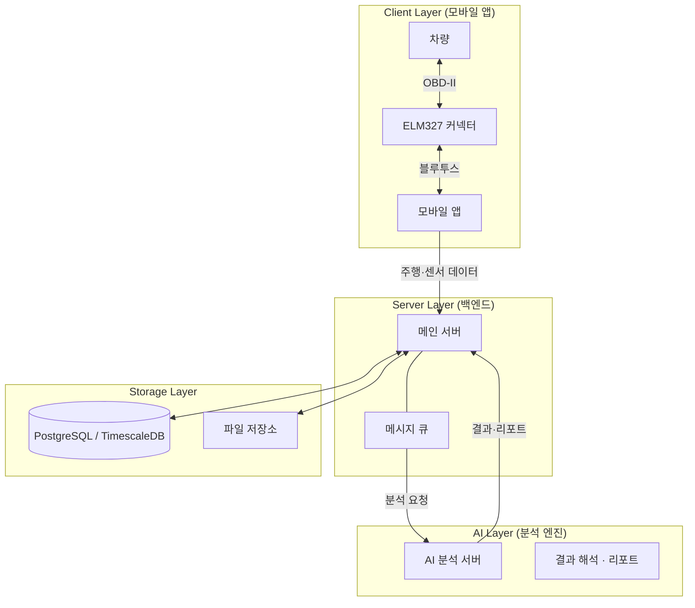

# AI 자동차 건강 관리 시스템

> **차량 데이터와 인공지능을 결합해 고장을 미리 알려주는 똑똑한 차계부 서비스**

자동차 실시간 정보를 수집해 이상을 미리 예측하고, 운전 습관에 맞는 관리법을 제안하는 시스템입니다.  
단순 진단을 넘어 AI가 주행 기록을 학습해 **고장 전에 미리 알려주고**, "나보다 내 차를 더 잘 아는" 맞춤형 서비스를 제공합니다.

---

## 핵심 기능

- **고장 예측**: 센서·엔진음·부품 사진을 분석해 부품 수명·이상 징후 예측
- **DTC 즉시 알림**: 경고등(DTC) 점등 시 실시간 감지·알림 (실시간 알림은 DTC에 한함)
- **차량 건강 리포트**: 주행 기록 요약 + 다음 정비 항목 제안
- **멀티모달 셀프 점검**: 시동음 녹음, 엔진룸/타이어 사진으로 AI 진단
- **제조사 계정 연동**: 차량 정보 자동 연동·안전 저장

---

## 시스템 아키텍처

전체는 **Client(앱)·Server(백엔드)·Storage(DB)·AI(분석엔진)** 네 계층으로 구성됩니다.  
실제 차량은 **ELM327 커넥터**로 앱과 연결되고, 앱이 수집한 주행·센서 데이터를 메인 서버로 보냅니다. (개발·테스트 시에는 에뮬레이터로 시뮬레이션 가능.)



- **Client**: ELM327로 차량(OBD-II)과 연결해 데이터 수집, DTC 시 간단 알림
- **Server**: 사용자·차량·주행 관리, AI 작업 조율, 알림
- **Storage**: 주행/진단 데이터 저장, 중요 구간 상세 데이터 보관
- **AI**: 시계열·이미지·오디오 분석, DTC 해석(RAG). 분석 결과를 **LLM**이 진단 설명·권장 조치 등 사용자용 자연어 리포트로 변환

---

## 기술 스택

| 영역 | 기술 |
|:---|:---|
| **모바일** | React Native (Android/iOS) |
| **백엔드** | Java, Spring Boot |
| **AI 서빙** | Python, FastAPI |
| **AI/ML** | PyTorch, YOLOv8, LSTM |
| **DB** | PostgreSQL, TimescaleDB, pgvector |
| **캐시·세션** | Redis (OBD 배치 멱등 락, Refresh Token 저장) |
| **메시징** | RabbitMQ |
| **인프라** | Docker |
| **차량 연동** | ELM327 커넥터 (OBD-II) |

---

## 프로젝트 구조

| 경로 | 설명 |
|:---|:---|
| **`/backend`** | Spring Boot — API, DB, 메시지 큐 연동 |
| **`/frontend`** | React Native 앱 |
| **`/ai`** | Python AI 엔진 — FastAPI, 학습·추론 스크립트 |
| **`/docs`** | 기획·설계·아키텍처 문서 |
| **`/db`** | 스키마·시드 |
| **`/emulator`** | OBD 시뮬레이션 |

---

## Quick Start (Docker)

Docker만 있으면 DB·RabbitMQ·이미지가 한 번에 구성됩니다.

**1. 환경 설정**

```cmd
copy .env.example .env
```

**2. 서비스 기동**

```cmd
docker-compose up -d
```

| 서비스 | 접속 |
|:---|:---|
| PostgreSQL | `localhost:5432` |
| RabbitMQ 콘솔 | http://localhost:15672 (`guest` / `guest`) |

필수: Docker Desktop 실행, 프로젝트 루트에 `.env` 존재.

---

## 개발 환경 (로컬 실행)

### AI 서버 (Python)

```bash
conda create -n ai5 python=3.10
conda activate ai5
pip install torch torchvision torchaudio --index-url https://download.pytorch.org/whl/cu121
pip install -r ai/requirements.txt
uvicorn ai.app.main:app --reload --host 0.0.0.0 --port 8001
```

### 프론트엔드 (React Native)

```bash
npm install
# 터미널 1: 백엔드 & AI 서버
npm run server
# 터미널 2: 앱 실행 (QR 코드 출력)
npm run dev
```

실기기 테스트: PC와 폰을 같은 Wi‑Fi에 두고, `frontend/api/axios.ts`에서 PC IP를 설정하세요.

---

## 문서

- [프로젝트 기획서](docs/0.프로젝트%20기획서.md)
- [요구사항 정의서](docs/1.요구사항정의서.md)
- [시스템 아키텍처 상세](docs/2.아키텍처.md)
- [DB 설계서](docs/3.DB%20설계서.md)

---

© 2026 AI-5 Project Team
